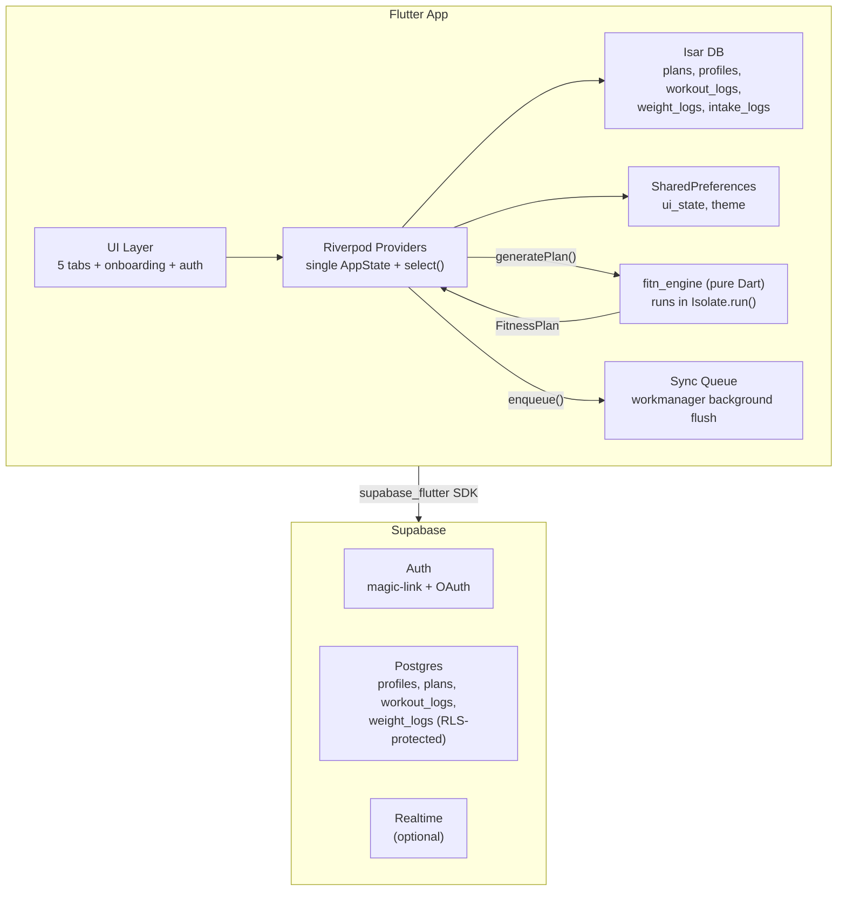
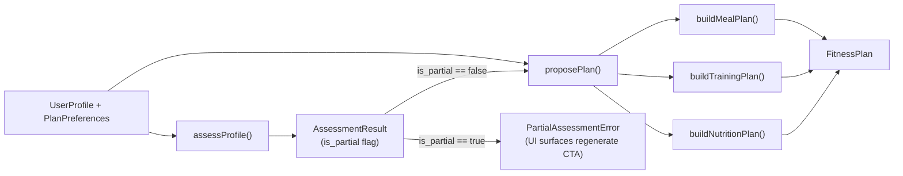
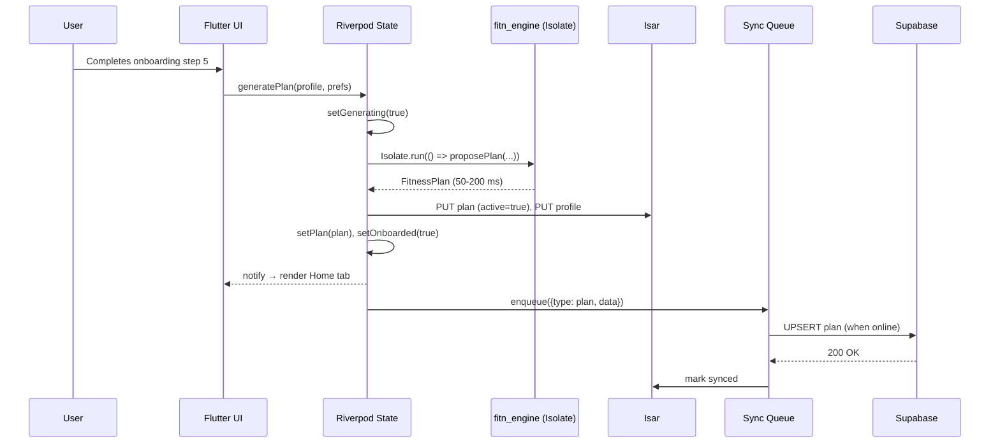

# Fitn — Flutter App Specification

**Product:** Fitn — a mobile fitness companion.
**Platform:** Flutter (iOS + Android), single Dart codebase.
**Audience:** Senior Flutter engineer. Build-ready.

This document specifies a fitness app built around a deterministic, physiology-grounded engine. The engine is the product's core value — its formulas, thresholds, and decision trees are pinned down completely. Everything around it (UI, state, storage, sync) is specified to a buildable level of detail, with implementation choices made where they matter and left to the engineer where they don't.

---

## 1. Product Vision

A mobile fitness companion that turns a 5-minute onboarding questionnaire into a fully personalized, deterministic fitness plan — body composition assessment, nutrition targets, multi-week training program, 7-day meal rotation — and then **stays with the user daily**: logging workouts, tracking progress, and tuning the plan as their body changes.

**The differentiator is the engine.** It's deterministic (same inputs → byte-identical output), grounded in published physiology (Mifflin-St Jeor, Katch-McArdle, Kouri FFMI, Hodgdon-Beckett Navy, CUN-BAE, ABSI, RippedBody volume landmarks, Lyle McDonald muscle-gain rates), and produces a coherent cut/bulk/recomp/maintenance/reverse-diet recommendation with a defensible rationale. The app's job is to get out of the engine's way.

**What the app must do well:**
1. **Onboard in 5 steps** — minimal friction, sensible defaults, never block on optional fields.
2. **Generate a plan in <500 ms** — instant feedback, no spinner anxiety.
3. **Work offline** — the plan, exercise library, and recipe database live on-device. Sync is a background concern, never a UX blocker.
4. **Log workouts** — sets, reps, weight, RPE. Rest timer. This is the daily-use loop.
5. **Track progress** — weight log, workout history, volume trends. The engine accepts weight/intake logs as inputs for adaptive TDEE; the UI must collect them.
6. **Sync across devices** — sign in, pick up where you left up on another phone.
7. **Regenerate gracefully** — when the user's body changes, the plan should update without losing history.

**What the app must NOT do:**
- Block on auth. Anonymous use is first-class.
- Require a server round-trip for plan generation.
- Lose data on sign-out (local data survives; only server-synced data is disowned).
- Pretend to be a marketplace. Commerce is out of scope.

---

## 2. Key Decisions

### 2.1 In scope

| Feature                               | Notes                                                                                            |
| ------------------------------------- | ------------------------------------------------------------------------------------------------ |
| On-device engine in a Dart isolate    | Plan generation is instant, offline, free. Runs via `Isolate.run()`; engine lives in a pure-Dart `fitn_engine` package. |
| 5-step onboarding                     | Minimal friction, sensible defaults, optional fields never block.                               |
| 5 main tabs                           | Home, Workouts, Meals, Progress, Profile.                                                       |
| Workout session logger                | Full-screen set/rep/weight/RPE logger with rest timer. Every set persists to `WorkoutLogRecord`. |
| Weight + intake logging               | Engine inputs for adaptive TDEE — collecting them closes the feedback loop. Stored as `WeightLogRecord` / `IntakeLogRecord`. |
| Progress tracking                     | Weight chart, volume trends, workout history, PRs (computed from workout logs).                 |
| Exercise library browser              | Browse all 1,217 exercises independently of a plan (search, filter by muscle/equipment).        |
| Plan versioning + restore             | History of generated plans with rollback.                                                       |
| Background sync queue                 | Optimistic local writes, `workmanager`-driven flush, `updated_at` conflict resolution.          |
| Anonymous-first auth                  | Plan works without sign-in. Optional Supabase auth (magic-link + Google/Apple OAuth) for cross-device sync. |
| Single program plan type              | Every plan is a program (≥1 mesocycle). No user-facing "standard vs program" toggle.            |
| Diet types: omnivore, vegetarian, vegan | Three supported diets. Engine rejects keto/paleo; UI does not expose them.                     |
| YouTube exercise videos               | Embedded via `youtube_player_flutter`. No local video hosting.                                  |

### 2.2 Out of scope (deferred)

| Item                                  | Why                                                                                              |
| ------------------------------------- | ------------------------------------------------------------------------------------------------ |
| Custom auth tables (`Account`, `Session`, `VerificationToken`) | Supabase Auth manages these internally.                                                         |
| Marketplace / commerce (`Product`, `WishlistItem` tables, checkout) | No payment integration. Build fresh when prioritized.                                          |
| Keto / paleo diet support             | Engine doesn't model them. Adding requires nutrition + meal plan rework.                        |
| Local video file hosting              | YouTube embeds cover the use case; bundling MP4s bloats the app.                                 |
| Realtime cross-device sync            | Pull-on-foreground + push-on-write is sufficient for launch. Supabase Realtime available later. |
| Edge Functions / server-side logic    | Not needed — all logic runs on-device.                                                           |
| Social features (sharing, leaderboards) | Not part of the single-user fitness companion model.                                           |
| Custom exercise / recipe creation     | Engine uses fixed libraries (1,217 exercises, ~400 recipes). Schema changes required to support. |
| Wear OS / watchOS companion           | Future enhancement for rest timer + set logging from the wrist.                                 |
| Apple Health / Google Fit sync        | Future enhancement for pulling weight + workouts from health APIs.                              |
| Adaptive plan adjustments UI          | Engine has `recommendCutAdjustment` / `recommendBulkAdjustment` (plateau detection + macro tuning). Wire into UI when users have 3+ weeks of weight logs. |

### 2.3 Stack

| Layer            | Choice                                   | Rationale                                                                  |
| ---------------- | ---------------------------------------- | -------------------------------------------------------------------------- |
| UI               | Flutter 3.x + Material 3                 | Single codebase, iOS + Android.                                            |
| State            | Riverpod 2.x (`AsyncNotifier` + `select`) | Fine-grained subscriptions, no re-render storms.                           |
| Navigation       | `go_router` 14.x                         | Deep links for auth callbacks, exercise deep-links.                        |
| Local DB         | Isar 4.x                                 | Structured data (plans, logs, history) with query support.                 |
| K/V prefs        | `shared_preferences`                     | UI state (active tab, has_onboarded, theme mode).                          |
| Engine runtime   | `Isolate.run()`                          | Plan generation off the UI thread.                                         |
| Auth + DB + Sync | Supabase (`supabase_flutter`)            | Auth (magic-link + OAuth), Postgres, Realtime, Storage — one SDK.          |
| HTTP             | `dio` 5.x                                | Interceptors, cancellation, retry.                                         |
| Secure storage   | `flutter_secure_storage`                 | Supabase refresh token.                                                    |
| Background sync  | `workmanager`                            | Flush sync queue when online.                                              |
| Charts           | `fl_chart` 0.70+                         | Weight log, volume trends, macro rings.                                    |
| YouTube          | `youtube_player_flutter`                 | Native player, no webview overhead.                                        |
| Animations       | `flutter_animate`                        | Fade, slide, count-up, shimmer.                                            |
| Icons            | `lucide_icons`                           | Open icon set, broad coverage.                                             |
| Models           | `freezed` + `json_serializable`          | Immutable, `copyWith`, JSON.                                               |
| Validation       | `freezed` constructors + `Result` types  | No external schema lib; Dart's type system + null safety suffices.         |
| Engine package   | `fitn_engine` (pure Dart)                | No Flutter deps. Ships JSON data as assets.                                |

### 2.4 Why Supabase

Supabase provides Postgres, Auth (magic-link + OAuth), Realtime, and Storage as one service with one Flutter SDK. For a mobile app this avoids deploying, monitoring, and scaling a custom backend. The data model is plain Postgres with row-level security (RLS), so the data is portable — Supabase is a hosting layer, not a proprietary lock-in.

Supabase provides:
- **Postgres** with row-level security — no server code needed for CRUD.
- **Auth** with magic-link, Google, Apple, GitHub out of the box.
- **Realtime** (optional — cross-device live sync; not needed for launch).
- **Storage** for any future self-hosted media (not needed — YouTube embeds suffice).
- **Edge Functions** if server-side logic is ever needed (not needed for launch).

---

## 3. Architecture

### 3.1 High-level



### 3.2 Engine orchestration



**Critical contract:** `proposePlan()` refuses to run on a partial assessment. The UI must check `assessment.isPartial` first and show a "regenerate" CTA instead of attempting plan generation.

### 3.3 Plan generation lifecycle



Generation is local and synchronous from the UI's perspective (the isolate is an implementation detail). Sync is queued and flushed in the background. Failures are retried with exponential backoff, never shown to the user unless they persist for >24h.

### 3.4 Sync protocol

- **Optimistic local writes** — every mutation writes to Isar immediately with `syncStatus: pending`.
- **Background flush** — `workmanager` runs every 15 min (when online), drains the queue.
- **Conflict resolution** — `updated_at` timestamp. Server wins if `server.updated_at > local.updated_at`. Last-writer-wins is fine for this domain (single user, single device active at a time in practice).
- **Push** — `UPSERT` to Supabase with `WHERE user_id = auth.uid()` (RLS enforces ownership).
- **Pull** — on sign-in, fetch all rows for the user, merge by `updated_at`.
- **No realtime at launch** — cross-device live sync is nice-to-have, not required. Pull-on-foreground + push-on-write is sufficient.

---

## 4. Engine (`fitn_engine` package)

Pure Dart. No Flutter. No I/O. JSON data files loaded from `assets/` at construction.

**Public API:**

```dart
// fitn_engine/lib/fitn_engine.dart

class FitnEngine {
  FitnEngine({required EngineData data});  // data loaded by caller

  AssessmentResult assessProfile(UserProfile profile);
  FitnessPlan proposePlan(UserProfile profile, AssessmentResult assessment, PlanPreferences prefs);
  GeneratePlanResponse generatePlan(UserProfile profile, PlanPreferences prefs);  // convenience: assess + propose
}

class EngineData {
  final List<Exercise> exercises;        // 1,217
  final List<SplitDesign> splits;        // 8
  final Map<String, MovementPatternSpec> movementPatterns;  // 40
  final List<Recipe> recipes;            // ~400 (curated + uncurated + pre/post)
  final Map<String, FoodItem> foodDatabase;
}

// Loads from rootBundle (Flutter) or File (CLI/test)
Future<EngineData> loadEngineData({String? basePath});
```

### 4.1 Domain models (Dart `freezed`)

All field names use `camelCase` in Dart, `snake_case` on the wire (via `@JsonKey`).

#### 4.1.1 Enums

```dart
enum Sex { male, female }

enum ActivityLevel { sedentary, mostlySedentary, lightlyActive, active, highlyActive }

enum TrainingStatus { beginner, novice, intermediate, advanced }

enum PrimaryGoal { fatLoss, muscleGain, recomp, maintenance, strength }

enum EquipmentAccess { fullGym, homeGym, bodyweightOnly }

enum DietType { omnivore, vegetarian, vegan }  // keto/paleo unsupported by engine

enum CutRateTier { veryConservative, conservative, moderate, aggressive, veryAggressive }

enum BulkAggressiveness { conservative, happyMedium, aggressive, veryAggressive }

enum TrainingTimeOfDay { morning, midday, evening }

enum ExerciseIntensity { light, moderate, intense }

enum Climate { cold, temperate, hot, hotHumid }

// Assessment
enum BodyFatMethod { userProvided, navy, cunBae }
enum BodyFatCategory { essential, athlete, fitness, acceptable, obesity }
enum BMICategory { underweight, normal, overweight, obese }
enum HealthRiskLevel { low, moderate, high, veryHigh }
enum ABSIRiskLevel { low, belowAverage, average, aboveAverage, high }
enum RecommendedStrategy { cut, bulk, recomp, maintenance, habitChangeFirst, reverseDiet }

// Nutrition
enum RMRFormula { mifflinStJeor, harrisBenedictOriginal, harrisBenedictRevised, cunningham, katchMcArdle }
enum CalorieStrategy { deficit, surplus, maintenance, recomp, reverseDiet }

// Training
enum TrainingGoal { strength, hypertrophy, generalFitness, fatLoss, muscleGain, recomp, maintenance }
enum SplitType { fullBody, upperLower, ppl, pplX2, pushPullLegsUpperLower, bodyPart, pushPull }
enum ProgressionScheme { linear, dup, block }
enum ExerciseCategory { compoundPrimary, compoundSecondary, accessory, cardio, mobility }
enum ExperienceLevel { beginner, intermediate, advanced }  // lowercase in Dart; capitalize on display

// Meal
enum MealType { breakfast, lunch, dinner, snack, side, preWorkout, postWorkout }
enum RecipeDietTag { omni, vegan, veganEthiopian, vegetarian, omniEthiopian }
enum FoodCategory { proteinAnimal, proteinPlant, dairy, carbGrain, carbStarchyVeg, carbFruit, fatOil, fatNutSeed, vegetable, beverage }
```

#### 4.1.2 Inputs

```dart
@freezed
class UserProfile with _$UserProfile {
  const factory UserProfile({
    required int age,                    // 18–100
    required Sex sex,
    required double heightCm,            // 140–230
    required double weightKg,            // 35–300
    required ActivityLevel activityLevel,
    required TrainingStatus trainingStatus,
    required PrimaryGoal primaryGoal,
    required int trainingDaysPerWeek,    // 2–6
    required EquipmentAccess equipmentAccess,
    @Default(DietType.omnivore) DietType dietType,
    double? bodyFatPct,                  // 2–60, null = unknown
    double? neckCm,                      // 20–80
    double? waistCm,                     // 40–200
    double? hipCm,                       // 40–200 (required for female Navy BF)
    CutRateTier? cutRateTier,
    BulkAggressiveness? bulkAggressiveness,
    @Default(TrainingTimeOfDay.evening) TrainingTimeOfDay trainingTimeOfDay,
    @Default([]) List<double> weightLogKg,       // each 30–300, max 365
    @Default([]) List<double> intakeLogKcal,     // each 0–10000, max 365
  }) = _UserProfile;

  const UserProfile._();

  double get bmi => weightKg / (heightCm / 100 * heightCm / 100);
  double get heightM => heightCm / 100;
  double get heightIn => heightCm / 2.54;
  double get weightLb => weightKg * 2.2046226218;
  bool get hasCircumferenceMeasurements => switch (sex) {
    Sex.male   => neckCm != null && waistCm != null,
    Sex.female => neckCm != null && waistCm != null && hipCm != null,
  };
}

@freezed
class PlanPreferences with _$PlanPreferences {
  const factory PlanPreferences({
    @Default(1.0) double exerciseHoursPerDay,    // 0.25–4
    @Default(ExerciseIntensity.moderate) ExerciseIntensity exerciseIntensity,
    @Default(Climate.temperate) Climate climate,
    @Default(0.0) double weightReducedPct,       // 0.0–1.0
    List<String>? muscleFocus,                    // e.g. ["chest", "back", "shoulders", "arms", "legs", "glutes", "core", "calves"]
    int? programDurationWeeks,                    // 4–52
    @Default(3) int mealFrequency,                // 2–6
    String? cuisinePreference,                    // e.g. "ethiopian", "italian", "american"
    List<String>? allergensToAvoid,               // ["dairy", "gluten", "eggs", "soy", "peanuts", "tree_nuts", "shellfish", "fish", "sesame", "corn"]
    List<String>? excludedIngredients,
    @Default(false) bool includePrePostWorkout,
  }) = _PlanPreferences;
}
```

**Construction-time validation** throws `ArgumentError` with a clear message on:
- Range violations (age, height, weight, training_days, body_fat_pct, log entries)
- Mismatched log lengths (`weightLogKg.length != intakeLogKcal.length` when both non-empty)

#### 4.1.3 Outputs

The full output tree (`AssessmentResult`, `BodyComposition`, `HealthRiskAssessment`, `MuscularPotential`, `NutritionPlan`, `RMRResult`, `TDEEResult`, `CalorieTargets`, `MacroSplit`, `HydrationTarget`, `MicronutrientTargets`, `TrainingPlan`, `Mesocycle`, `Microcycle`, `Workout`, `WorkoutExercise`, `Exercise`, `MealPlan`, `DayPlan`, `Meal`, `Recipe`, `MealFood`, `FoodItem`, `FitnessPlan`) is defined in §9.1 (Output model reference).

### 4.2 Assessment sub-engine

Orchestration (`assessProfile`) runs 4 sub-assessments in order, **never short-circuiting on failure**:

1. `assessBodyComposition(profile)` — root of the dependency tree.
2. `assessHealthRisk(profile)` — independent of body comp.
3. `assessMuscularPotential(profile, bodyComp.bodyFatPct)` — **skipped** if `bodyComp == null`.
4. `decideStrategy(profile, bodyComp.bodyFatPct)` — **skipped** if `bodyComp == null`, defaults to `maintenance`.

If any sub-assessment throws, record `"sub_name: ArgumentError: <msg>"` in `errors` and set the sub-result to null. `is_partial = errors.isNotEmpty`. The summary string is built defensively (every nullable field guarded).

`proposePlan()` throws `PartialAssessmentError` if called with `is_partial == true`.

#### 4.2.1 Body fat % selection (priority order)

1. **User-provided** (`bodyFatPct != null`) → use as-is.
2. **US Navy circumference** (Hodgdon & Beckett 1984) — if `hasCircumferenceMeasurements`:
   - Male: `86.010 × log10(waistIn − neckIn) − 70.041 × log10(heightIn) + 36.76`
   - Female: `163.205 × log10(waistIn + hipIn − neckIn) − 97.684 × log10(heightIn) − 78.387`
   - If `(waistIn − neckIn) ≤ 0` (male) or `(waistIn + hipIn − neckIn) ≤ 0` (female), return null → fall through to CUN-BAE.
   - Clamp to `[2.0, 60.0]`.
3. **CUN-BAE** (always computable):
   - `bf = -24.988 + 0.503 × age + 1.0689 × bmi + 0.462 × (sex == female ? 1.0 : 0.0)`
   - Clamp to `[2.0, 60.0]`.

#### 4.2.2 BMI categories

| Category     | BMI range            |
| ------------ | -------------------- |
| UNDERWEIGHT  | `[0, 18.5)`          |
| NORMAL       | `[18.5, 25.0)`       |
| OVERWEIGHT   | `[25.0, 30.0)`       |
| OBESE        | `[30.0, +∞)`         |

#### 4.2.3 Body fat categories (sex-specific)

| Category     | Male BF%       | Female BF%      |
| ------------ | -------------- | --------------- |
| ESSENTIAL    | `[0, 6)`       | `[0, 14)`       |
| ATHLETE      | `[6, 14)`      | `[14, 21)`      |
| FITNESS      | `[14, 18)`     | `[21, 25)`      |
| ACCEPTABLE   | `[18, 25)`     | `[25, 32)`      |
| OBESITY      | `[25, +∞)`     | `[32, +∞)`      |

#### 4.2.4 FFMI (Kouri 1995)

- `ffmKg = weightKg × (1 − bfPct/100)`
- `ffmi = ffmKg / heightM²`
- `normalizedFfmi = ffmi + 6.1 × (1.8 − heightM)`

**Ceiling constants:** `FFMI_NATURAL_COMMON = 25.0`, `ATTAINABLE = 27.3`, `LIKELY_MAX = 28.0`. Normalization coefficient `6.1`, reference height `1.8 m`.

**Named target BF% landmarks** (for `targetWeightsKg` map):

| Label            | Male | Female |
| ---------------- | ---- | ------ |
| athletic         | 14.0 | 21.0   |
| fitness          | 18.0 | 25.0   |
| acceptable       | 25.0 | 32.0   |
| hormonal_floor   | 10.0 | 18.0   |

`targetWeight = lbm / (1 − targetBf/100)` where `lbm = currentWeight × (1 − currentBf/100)`.

#### 4.2.5 Health risk

| Metric | Formula | Classification |
| ------ | ------- | -------------- |
| **WHR** | `waist / hip` | Male: ≤0.85 LOW, ≤0.90 MOD, ≤1.0 HIGH, >1.0 VERY_HIGH. Female: ≤0.80 LOW, ≤0.85 MOD, ≤1.0 HIGH, >1.0 VERY_HIGH. |
| **WHtR** | `waist / height` | Male: <0.50 LOW, <0.53 MOD, <0.58 HIGH, ≥0.58 VERY_HIGH. Female: <0.46 LOW, <0.49 MOD, <0.54 HIGH, ≥0.54 VERY_HIGH. |
| **ABSI** | `(waist_m) × weight^(-2/3) × height^(5/6)` | Z-score from NHANES 10-year age bands (see §9.3). |
| **IBW** | `base + mult × (heightIn − 60)` | 4 formulas: Devine (50/2.3 M, 45.5/2.3 F), Robinson (52/1.9, 49/1.7), Miller (56.2/1.41, 53.1/1.36), Hamwi (48/2.7, 45.4/2.2). |

**Overall risk** (weighted heuristic): ABSI weight 0.5, WHR 0.3, WHtR 0.2. Add weight when the metric is HIGH/VERY_HIGH (ABSI: ABOVE_AVERAGE/HIGH). Map: ≥0.75 → VERY_HIGH, ≥0.50 → HIGH, any clinical risk factor → MODERATE, else LOW.

#### 4.2.6 Muscular potential

- Use **normalized FFMI** for ceiling comparison.
- `ffmiToCeilingPct = clamp(normalizedFfmi / 25.0 × 100, 0, 100)`.
- `headroomKg = max(0, ffmAtCeiling − ffmKg)` where `ffmAtCeiling = (25.0 − 6.1 × (1.8 − heightM)) × heightM²`.
- **Berkhan stage max** (men only): `heightCm − 100` at 5-6% BF. Null for women (essential BF floor is ~10-13%, not 5-6%).
- **Expected monthly muscle gain** (Lyle McDonald, men; × 0.5 for women):

| Status        | Monthly gain (men) |
| ------------- | ------------------ |
| BEGINNER      | 0.85 kg            |
| NOVICE        | 0.575 kg           |
| INTERMEDIATE  | 0.325 kg           |
| ADVANCED      | 0.10 kg            |

#### 4.2.7 Strategy decision tree

**Sex-specific boundaries** (single source of truth):

| Boundary           | Male | Female |
| ------------------ | ---- | ------ |
| cut_floor          | 10   | 18     |
| bulk_ceiling       | 20   | 28     |
| bulk_start         | 15   | 23     |
| operational_lo     | 10   | 18     |
| operational_hi     | 20   | 28     |
| obese_threshold    | 25   | 32     |
| recomp_excellent   | 23   | 30     |
| recomp_good_lo     | 15   | 25     |
| recomp_limited     | 15   | 25     |
| skinny_fat_lo      | 12   | 20     |
| skinny_fat_hi      | 23   | 31     |

**Algorithm (first match wins):**

1. **Safety override (obesity):** `bfPct >= obese_threshold`:
   - BEGINNER + goal != fat_loss → `habitChangeFirst` ("start with habit changes before calorie counting")
   - Else → `cut` ("prioritise fat loss")
2. **Goal = maintenance:**
   - If `bfPct < hormonal_floor` → warn about bulk.
   - If `bfPct > operational_hi` → warn about cut.
   - **Reverse-diet detection:** if `intakeLogKcal.length >= 30` AND `operational_lo <= bfPct <= operational_hi`:
     - Trailing 7-day avg intake vs estimated TDEE (compute via RMR+TDEE pipeline; fallback `weightKg × 35`).
     - If `recentIntake < tdee × 0.90` → `reverseDiet`.
   - Else → `maintenance`.
3. **Goal = strength:** if `bfPct > bulk_ceiling` → `cut`; else `maintenance`.
4. **Goal = fat_loss:** if `bfPct < cut_floor` → `maintenance` (protect hormones); else `cut`.
5. **Goal = muscle_gain:** if `bfPct > bulk_ceiling` → `cut`; else `bulk`.
6. **Goal = recomp:** `bfPct >= recomp_excellent` → `recomp` (excellent); `>= recomp_good_lo` → `recomp` (good); else `bulk` (limited).
7. **Auto-decide (no explicit goal override — fallback path):**
   - `bfPct > operational_hi` → `cut`
   - `bfPct < cut_floor` → `bulk`
   - Novice + skinny-fat range → `recomp`
   - Novice + `bfPct < bulk_start` → `recomp` (milk newbie gains)
   - `bfPct < bulk_start` → `bulk`
   - Else → `cut`

### 4.3 Nutrition sub-engine

`buildNutritionPlan(profile, assessment, exerciseHours, exerciseIntensity, climate, weightReducedPct)`:

1. **RMR** — `KATCH_MCARDLE` if `bodyFatPct != null`, else `MIFFLIN_ST_JEOR`.
   - Mifflin: `10 × weight + 6.25 × height − 5 × age + (male ? 5 : -161)`
   - Katch-McArdle: `370 + 21.6 × lbm` (throws if `bfPct ∉ [2, 60]`)
   - Adjustments: `× 0.95` if active deficit (cut/recomp), `× 0.97` if `weightReducedPct > 0.10`.
2. **TDEE** — RippedBody activity factors (1.25 / 1.45 / 1.65 / 1.85 / 2.05 for sedentary / mostly_sedentary / lightly_active / active / highly_active).
3. **Adaptive TDEE** — if `weightLogKg` and `intakeLogKcal` are both non-empty, equal-length, and ≥8 entries:
   - `observed = avgIntake − (Δweight × 7700) / nDays`
   - Sanity: `observed ∈ [800, 7000]`, else skip.
   - Ramp weight: `w = clamp((nDays − 7) / 53, 0, 1)` — no adaptation below 7 days, full at 60+.
   - `adaptive = w × observed + (1 − w) × tdee`.
4. **Calorie targets** — by strategy, with floor 1200 (F) / 1500 (M):

| Strategy           | Computation                                                                                       |
| ------------------ | ------------------------------------------------------------------------------------------------- |
| cut                | `weeklyLoss = weight × rate`; `dailyDeficit = weeklyLoss × 1100`; `target = tdee − dailyDeficit` |
| bulk               | `monthlyGain = weight × rate`; `dailySurplus = monthlyGain × 330`; `target = tdee + dailySurplus` |
| maintenance        | `target = tdee`                                                                                   |
| recomp             | `target = tdee × (1 − deficitPct)` where deficitPct = 0.15/0.05/0.0 by recomp potential           |
| reverse_diet       | Weekly ladder: `+50/+100/+150 kcal/wk` by aggressiveness, until target reached                    |
| habit_change_first | Same as maintenance                                                                               |

**Cut rate** (priority): explicit `cutRateTier` → BF%-threshold table → default 0.75% BW/week. Hard cap 1.0% BW/week.

**Cut rate by BF% threshold** (first match):

| Sex    | Thresholds (BF%) | Rate (% BW/week)   |
| ------ | ---------------- | ------------------ |
| Male   | [25, 20, 15]     | [1.00, 0.75, 0.50, 0.50] |
| Female | [32, 28, 22]     | [1.00, 0.75, 0.50, 0.50] |

**Bulk rate** (priority): explicit `bulkAggressiveness × trainingStatus` table → default by status (beginner 2%/mo, novice 1.5%/mo, intermediate 1%/mo, advanced 0.5%/mo).

**Bulk weekly rate tiers** (% BW/week):

| Aggressiveness     | Beginner/Novice | Intermediate | Advanced |
| ------------------ | --------------- | ------------ | -------- |
| conservative       | 0.0020          | 0.0015       | 0.0010   |
| happyMedium        | 0.0050          | 0.00325      | 0.0015   |
| aggressive         | 0.0080          | 0.00575      | 0.0035   |
| veryAggressive     | 0.0100          | 0.00800      | 0.0060   |

5. **Macros:**
   - **Protein:**
     - Obese override (`bfPct >= obese_threshold`): `1 g × heightCm`.
     - BF% known: `lbm_lb × 1.14` (cut) or `× 1.0` (else).
     - BF% unknown: `target_weight_lb × 1.0` (cut, target = 90% current) or `weight_lb × 0.73` (else).
     - Diet boost: vegan ×1.20 (ceil), vegetarian ×1.10 (ceil).
   - **Fat:** midpoint of strategy range (deficit/recomp: 15-25%; surplus/maintenance/reverse: 20-30%). Floor: `max(40, weight_lb × 0.25)`. Saturated ceiling: 10% of calories.
   - **Carbs:** remainder = `targetKcal − proteinKcal − fatKcal`, clamped to ≥0.
6. **Hydration** (multi-step FatCalc):
   - Base: `weightKg × 0.030 L`
   - Sex: +0.3 L (male)
   - Exercise: `hours × sweatRate / 1000` (light 300, moderate 500, intense 800 mL/hr)
   - Climate multiplier (cold 0.95, temperate 1.0, hot 1.3, hot_humid 1.4) applied to exercise component only
   - Pregnancy +0.3 L, breastfeeding +0.7 L (throws if male)
   - Soft ceiling 5.0 L (hyponatremia protection)
7. **Micronutrients:** fiber = `14 g × targetKcal / 1000`. Fruit/veg cups: 2/2 (≤2000 kcal), 3/3 (≤3000), 4/4 (≤4000+).
8. **Timeline:**
   - Cut: `max(4, floor(kgToLose / weeklyRateKg) + 4)` where target BF = `operational_lo + 2`.
   - Bulk: `max(12, floor((targetGainKg / monthlyRateKg) × 4.348) + 4)` where targetGain = 5% BW.
   - Recomp: 12 weeks. Maintenance: 12. Habit-change: 8. Reverse-diet: parse from notes, default 8.

### 4.4 Training sub-engine

`buildTrainingPlan(profile, assessment, muscleFocus, programDurationWeeks)`:

1. **Derive goal** from `(primaryGoal, recommendedStrategy)`:

| primaryGoal | strategy                                        | → TrainingGoal      |
| ----------- | ----------------------------------------------- | -------------------- |
| strength    | maintenance / bulk / recomp                     | strength             |
| (any)       | cut                                             | fatLoss              |
| (any)       | bulk                                            | muscleGain           |
| (any)       | recomp                                          | recomp               |
| (any)       | maintenance                                     | maintenance          |
| (any)       | habitChangeFirst                                | generalFitness       |
| (any)       | reverseDiet (or unmapped)                       | hypertrophy (fallback) |

2. **Pick split** from 8 designs (`split_designs.json`):
   - Filter by `days_per_week` → by `experience` AND `goal` → by `experience` → by `goal` → all.
   - Tie-break by experience preference order:
     - BEGINNER: fullBody > upperLower > ppl
     - NOVICE: fullBody > upperLower > ppl > pushPull
     - INTERMEDIATE: upperLower > fullBody > ppl > pplul > pplX2
     - ADVANCED: pplX2 > pplul > bodyPart > upperLower > fullBody
3. **Pick progression:** BLOCK if (strength + intermediate/advanced); else LINEAR (beginner/novice), DUP (intermediate), BLOCK (advanced).
4. **Apply muscle focus:** for each focus muscle, append 1-2 accessory slots to templates that already train that muscle.

| Focus muscle | Added slots (category, sets, pattern)                                       |
| ------------ | --------------------------------------------------------------------------- |
| chest        | chest_fly accessory × 3; incline_push accessory × 3                         |
| back         | seated_row accessory × 3; vertical_pull accessory × 3                       |
| quads        | knee_extension accessory × 3; front_squat compound_secondary × 3            |
| hamstrings   | knee_flexion accessory × 3; romanian_deadlift accessory × 3                 |
| glutes       | hip_thrust compound_secondary × 3; glute_isolation accessory × 3            |
| shoulders    | lateral_raise accessory × 4; rear_delt accessory × 3                        |
| arms         | elbow_flexion accessory × 4; elbow_extension accessory × 4                  |
| biceps       | elbow_flexion accessory × 4                                                 |
| triceps      | elbow_extension accessory × 4                                               |
| calves       | ankle_plantarflexion accessory × 5                                          |
| abs          | core_anti_extension accessory × 3; core_anti_rotation accessory × 3         |

5. **Build workouts from templates** — for each slot, run the **7-tier exercise selector**:
   - Equipment filter (full_gym: 33 types, home_gym: 9, bodyweight_only: 2).
   - Exclude CARDIO/MOBILITY categories; exclude plyometrics for beginners.
   - Tier 1-7: progressively relax constraints (pattern → muscle → category), experience enforced or relaxed.
   - Sort by: equipment preference rank → experience distance → view count → name.
   - Movement pattern detection: keyword match (slug wins 100+length, name wins length) → force-type fallback → primary-muscle fallback.
6. **Build mesocycles:**
   - Mesocycle length: 4w (beginner/novice), 5w (intermediate), 6w (advanced).
   - Program duration: 4/8/10/12w by experience (bumped to 12 if strength + intermediate/advanced). User override: 4-52w.
   - `numMesocycles = max(1, floor(duration / mesoLength))`.
   - Each mesocycle's last week is a deload (sets × 0.5, RPE − 1.5).
   - BLOCK progression: assign phases across mesocycles — 1→[accumulation], 2→[accumulation, intensification], 3+→[accumulation, intensification, peak].
7. **Apply periodization** (5 layers, in order):
   - **Layer 1 — Goal preset** (base reps/rest/RPE by goal × exercise category).
   - **Layer 2 — DUP day-type modifiers** (heavy/moderate/light, only if `dayType` set on template).
   - **Layer 3 — Block phase modifiers** (accumulation/intensification/peak; for strength + compound_primary, use StrengthPhase specs).
   - **Layer 4 — Deload** (sets × 0.5, RPE − 1.5).
   - **Layer 5 — RIR clamp** (lookup RIR range by tier × rep range, convert to RPE bounds, clamp).
8. **Compute weekly volume** (fractional set counting: primary 1.0, secondary 0.5, dedupe secondary against primary).
9. **Validate volume** against landmarks (MEV/MAV/MRV/ML for 22 muscles + default fallback).
10. **Per-session cap:** 11 sets/muscle/workout — warn if exceeded.

**Goal presets** (reps / rest_sec / RPE):

| Goal             | Compound Primary | Compound Secondary | Accessory    | Cardio        | Mobility      |
| ---------------- | ---------------- | ------------------ | ------------ | ------------- | ------------- |
| strength         | 3-6 / 240 / 8.5  | 5-8 / 180 / 8.0    | 8-12 / 90 / 7.0 | 20-45 min / 0 / 5.0 | 30-60 sec / 30 / 4.0 |
| hypertrophy / muscleGain / recomp | 5-8 / 180 / 8.0 | 8-12 / 120 / 7.0 | 10-15 / 60 / 6.0 | 20-30 min / 0 / 5.0 | 30-60 sec / 30 / 4.0 |
| fatLoss          | 6-10 / 120 / 7.5 | 8-12 / 90 / 7.0    | 12-20 / 45 / 6.0 | 20-45 min / 0 / 5.0 | 30-60 sec / 30 / 4.0 |
| generalFitness   | 8-12 / 120 / 7.0 | 10-15 / 90 / 6.5   | 12-20 / 60 / 6.0 | 20-45 min / 0 / 5.0 | 30-60 sec / 30 / 4.0 |
| maintenance      | 6-10 / 150 / 7.0 | 8-12 / 120 / 6.5   | 10-15 / 60 / 6.0 | 20-30 min / 0 / 5.0 | 30-60 sec / 30 / 4.0 |

**Volume landmarks** (`DEFAULT_MUSCLE_LANDMARKS`):

| Muscle                          | MEV | MAV_lo | MAV_hi | MRV | ML |
| -------------------------------- | --- | ------ | ------ | --- | -- |
| chest                            | 8   | 10     | 22     | 24  | 5  |
| back / upper_back / lats         | 10  | 14     | 22     | 27  | 7  |
| middle_back                      | 8   | 12     | 18     | 22  | 5  |
| lower_back                       | 3   | 4      | 8      | 15  | 2  |
| traps                            | 4   | 6      | 12     | 18  | 3  |
| quads                            | 8   | 12     | 20     | 25  | 6  |
| hamstrings                       | 6   | 10     | 16     | 20  | 5  |
| glutes                           | 4   | 8      | 16     | 20  | 3  |
| adductors / abductors            | 4   | 6      | 12     | 16  | 3  |
| hip_flexors                      | 2   | 4      | 8      | 10  | 2  |
| shoulders / side_delts           | 6   | 8      | 16     | 20  | 4  |
| rear_delts                       | 4   | 6      | 12     | 16  | 3  |
| triceps                          | 6   | 8      | 14     | 18  | 4  |
| biceps                           | 6   | 8      | 14     | 20  | 4  |
| forearms                         | 3   | 4      | 8      | 15  | 2  |
| calves                           | 8   | 10     | 16     | 20  | 5  |
| abs                              | 6   | 10     | 20     | 25  | 5  |
| obliques                         | 4   | 6      | 12     | 18  | 3  |
| (unknown — fallback)             | 6   | 10     | 16     | 25  | 5  |

**Recommended weekly sets** = `mavMid × tierMultiplier × goalMultiplier × experienceMultiplier`, floored at ML (maintenance) or MEV (else).

- Goal multipliers: hypertrophy/muscleGain 1.0, recomp 0.9, strength 0.7, fatLoss 0.8, maintenance 0.6, generalFitness 0.7.
- Experience multipliers: beginner 0.7, novice 0.85, intermediate 1.0, advanced 1.1.
- Tier multipliers (MINIMAL/LOW/MEDIUM/HIGH/VERY_HIGH → 4-8/9-12/13-16/17-20/21-30 sets/muscle/wk), normalized so MEDIUM = 1.0.

**RIR intensity tiers:**

| Tier                            | 1-3 reps | 4-6 reps | 7-10 reps | 11-20 reps | 21-50 reps |
| ------------------------------- | -------- | -------- | --------- | ---------- | ---------- |
| LOWER_FREE_WEIGHT_COMPOUND      | [0, 1]   | [1, 3]   | [2, 4]    | [3, 5]     | —          |
| MACHINE_OR_UPPER_PRESS          | [0, 2]   | [1, 3]   | [2, 4]    | [3, 5]     | —          |
| MACHINE_PRESS_OR_PULL           | [1, 3]   | [2, 4]   | [2, 4]    | [3, 5]     | —          |
| ISOLATION (default)             | [1, 3]   | [2, 4]   | [2, 4]    | [3, 5]     | [4, 6]     |

`RPE = clamp(10 − RIR, 4, 10)`.

### 4.5 Meal plan sub-engine

`buildMealPlan(profile, assessment, nutrition, mealFrequency, cuisinePreference, allergensToAvoid, excludedIngredients, includePrePostWorkout)`:

1. **Compute slot targets** from daily macros × meal allocation:

| Frequency | Allocation                                              |
| --------- | ------------------------------------------------------- |
| 2 meals   | LUNCH 0.50, DINNER 0.50 (no breakfast — intentional)   |
| 3 meals   | BREAKFAST 0.30, LUNCH 0.35, DINNER 0.35                 |
| 4 meals   | BREAKFAST 0.25, LUNCH 0.30, DINNER 0.30, SNACK 0.15    |
| 5 meals   | BREAKFAST 0.20, LUNCH 0.25, DINNER 0.30, SNACK 0.15, SNACK 0.10 |

2. **Determine training days** for the 7-day week:
   - 2d → [1, 4], 3d → [1, 3, 5], 4d → [1, 2, 4, 5], 5d → [1, 2, 3, 4, 5], 6d → [1, 2, 3, 4, 5, 6].
3. **For each of 7 days × N slots:** allocate meal via `scoreRecipeForSlot` → pick top → scale → fill gap.
4. **Track recipe usage** (rolling 3-day and 7-day windows) for variety scoring.

**Diet tag derivation:**
- omnivore → `"OMNI"`
- vegan → `"VEGAN"`
- vegetarian → `"VEGAN"` (recipe DB has no separate vegetarian tag — vegetarians get vegan recipes)

**Recipe scoring** (9 weighted components, each 0-100):

| Component        | Weight | Tight band | Loose band |
| ---------------- | ------ | ---------- | ---------- |
| kcal_match       | 26     | ±20%       | ±40%       |
| protein_match    | 22     | ±15%       | ±30%       |
| carb_match       | 13     | ±20%       | ±40%       |
| fat_match        | 9      | ±25%       | ±50%       |
| diet_match       | 13     | —          | —          |
| goal_fit         | 4      | —          | —          |
| fiber_match      | 4      | ±50%       | ±100%      |
| variety_bonus    | 4      | —          | —          |
| cuisine_match    | 5      | —          | —          |

**Hard exclusions** (score = 0):
- Allergen violation
- Excluded ingredient present
- Diet mismatch

**Allergen scanning** (best-in-class — plant-qualifier suppression):
- Normalize allergen aliases (`tree_nuts` → `nuts`, `crustacean(s)` → `shellfish`).
- Build word-boundary regexes for each allergen's keywords.
- Sanitize ingredients: blank out plant-named phrases (eggplant, butter lettuce, coconut milk, etc. — full list in §9.2) before scanning for `dairy` and `eggs`.
- For each `dairy`/`eggs` match, check 25-char context before for plant qualifiers (almond, soy, oat, coconut, etc. — full list in §9.2). If found, skip the match.
- Other allergens scan the unsanitized string.

**Recipe scaling:**
- `scaleFactor = clamp(targetKcal / recipeKcal, 0.7, 1.5)` (1.0 if within ±10%).
- Scaled nutrition = per-serving × scaleFactor.

**Filler system** (closes macro gap after scaling):

| Priority | Type     | Trigger (`gap >`) | OMNI options                                           | VEGAN* options                                |
| -------- | -------- | ----------------- | ------------------------------------------------------ | --------------------------------------------- |
| 1        | Protein  | 5 g               | Whey, Greek yogurt, egg white, cottage cheese, chicken | Tofu, tempeh, pea/soy protein, lentils        |
| 2        | Carb     | 5 g               | White/brown rice, oats, banana, whole wheat bread, quinoa, sweet potato | (same)                                        |
| 3        | Fat      | 3 g               | Olive oil, almonds, peanut butter, walnuts, avocado    | (same)                                        |
| 4        | Veg      | 3 g (main meals only) | Broccoli, spinach, mixed greens, bell pepper, asparagus, green beans, carrots | (same)                                        |

\* VEGAN prefix match — `VEGAN_ETHIOPIAN` resolves to VEGAN list.

Filler grams: `(targetG / food.per100g) × 100`, capped at `serving × {protein:4, carb:3, fat:3}`, min serving = `serving × 0.5`. Veg: fixed `[80g, 200g]`.

**Allergen → filler exclusion map:**
- dairy → Whey, Greek Yogurt, Cottage Cheese, Milk, Cheddar
- eggs → Egg White, Eggs
- gluten → Whole Wheat Bread, Oats
- nuts → Almonds, Walnuts
- peanuts → Peanut Butter
- soy → Tofu, Tempeh, Soy Protein, Edamame

**Swap system:**
- **Recipe swaps:** alternatives sharing ≥1 meal_type, diet-compatible, kcal within ±20%, no allergens, cuisine-matching if specified. Sorted by kcal closeness, limited to 5.
- **Ingredient swaps:** static substitution database (proteins, carbs, Ethiopian ingredients, fats, dairy alternatives, vegetables). Longest-key-first matching, plant-named-phrase protection.

**Recipe database** (~400 recipes from 3 JSON files merged at load):
- `recipe_database.json` (79 curated) — `is_curated=true`, notes get `[curated]` tag.
- `recipe_database_uncurated.json` (~305) — `is_curated=false`. ID collisions with curated → rename to `U<id>`.
- `pre_post_workout_recipes.json` (16) — 4 diets × 2 meal types × 2 kcal bins. `nutrition_source="calculated"`, `source="engine-generated"`.

**Load-time sanitization:**
- VEGAN-tagged recipe with meat/dairy/egg ingredients → append `[diet-warning: tagged VEGAN but ingredients contain meat/dairy/egg — likely a curation error]`.
- Stated kcal vs macro-derived kcal (P×4 + C×4 + F×9) > 10% off → append `[kcal-warning: ...]`.

**Meal name templates** (cycled by day for variety):
- 5-meal canonical order: BREAKFAST, SNACK, LUNCH, SNACK, DINNER (interleaved — NOT snacks at end).
- Each meal type has 7 default name options (e.g. breakfast: Greek Yogurt Parfait, Oatmeal Power Bowl, Egg & Avocado Toast, ...).


---

## 5. Data Model

### 5.1 Local (Isar) collections

The app owns these locally. All except `app_state` and `sync_queue` sync to Supabase.

```dart
@Collection()
class ProfileRecord {
  Id id = Isar.autoIncrement;           // always 1 (singleton per device)
  late String userId;                    // Supabase auth.uid() or "anonymous"
  late String dataJson;                  // serialized UserProfile + PlanPreferences
  @Index() late DateTime updatedAt;
  @Index() late String syncStatus;       // "pending" | "synced" | "conflict"
}

@Collection()
class PlanRecord {
  Id id = Isar.autoIncrement;
  late String userId;
  late String planId;                    // UUID, server-generated on first sync
  late String dataJson;                  // serialized FitnessPlan
  late String profileSnapshotJson;       // UserProfile at generation time
  late String preferencesSnapshotJson;
  late String engineVersion;             // "3.2.0"
  @Index() late bool isActive;           // only one true per user
  @Index() late DateTime generatedAt;
  @Index() late String syncStatus;
}

@Collection()
class WorkoutLogRecord {
  Id id = Isar.autoIncrement;
  late String userId;
  late String planId;                    // which plan this workout belongs to
  late int dayNumber;                    // 1-7 (week day)
  late DateTime startedAt;
  DateTime? completedAt;
  late String workoutName;
  late String dataJson;                  // List<SetEntry> — see below
  @Index() late String syncStatus;
}

class SetEntry {
  late String exerciseSlug;
  late int setNum;
  double? weightKg;
  int? reps;
  double? rpe;
  late bool done;
  late DateTime completedAt;
}

@Collection()
class WeightLogRecord {
  Id id = Isar.autoIncrement;
  late String userId;
  @Index() late DateTime date;
  late double weightKg;                  // 30-300
  @Index() late String syncStatus;
}

@Collection()
class IntakeLogRecord {
  Id id = Isar.autoIncrement;
  late String userId;
  @Index() late DateTime date;
  late double intakeKcal;                // 0-10000
  @Index() late String syncStatus;
}

@Collection()
class AppStateRecord {
  Id id = 1;                             // singleton
  late String activeTab;                 // "home" | "workouts" | "meals" | "progress" | "profile"
  late bool hasOnboarded;
  late bool planStale;                   // profile changed since last plan generation
  late String? activePlanId;
}

@Collection()
class SyncQueueRecord {
  Id id = Isar.autoIncrement;
  late String operationType;             // "upsert_profile" | "upsert_plan" | "upsert_workout_log" | ...
  late String recordId;                  // Isar id of the record to sync
  late String collectionName;            // "ProfileRecord" | "PlanRecord" | ...
  late int attempts;
  late DateTime? nextAttemptAt;
  @Index() late String status;           // "pending" | "in_progress" | "failed"
}
```

**Design notes:**
- `dataJson` fields store the full serialized object. Isar doesn't do nested objects well; we use it as a typed KV store for the big blobs and index only what we query by.
- `syncStatus` on every record enables the background flush to find pending rows quickly.
- `WorkoutLogRecord` is the daily-use loop — every set logged in a workout session persists here.
- `WeightLogRecord` and `IntakeLogRecord` feed back into the engine as `weightLogKg` and `intakeLogKcal` for adaptive TDEE on the next plan generation.

### 5.2 Remote (Supabase Postgres)

RLS-protected. Every table has `user_id UUID REFERENCES auth.users(id)`. Every policy is `USING (auth.uid() = user_id) WITH CHECK (auth.uid() = user_id)`.

```sql
-- profiles (1:1 with auth.users)
CREATE TABLE profiles (
  user_id UUID PRIMARY KEY REFERENCES auth.users(id) ON DELETE CASCADE,
  data JSONB NOT NULL,
  updated_at TIMESTAMPTZ NOT NULL DEFAULT now()
);

-- plans (1:N with users; one isActive per user)
CREATE TABLE plans (
  id UUID PRIMARY KEY DEFAULT gen_random_uuid(),
  user_id UUID NOT NULL REFERENCES auth.users(id) ON DELETE CASCADE,
  data JSONB NOT NULL,                  -- full FitnessPlan
  profile_snapshot JSONB NOT NULL,
  preferences_snapshot JSONB NOT NULL,
  engine_version TEXT NOT NULL,
  is_active BOOLEAN NOT NULL DEFAULT false,
  generated_at TIMESTAMPTZ NOT NULL DEFAULT now(),
  updated_at TIMESTAMPTZ NOT NULL DEFAULT now()
);
CREATE INDEX plans_user_active_generated_idx ON plans(user_id, is_active, generated_at DESC);
CREATE INDEX plans_user_generated_idx ON plans(user_id, generated_at DESC);

-- workout_logs (1:N with users + plans)
CREATE TABLE workout_logs (
  id UUID PRIMARY KEY DEFAULT gen_random_uuid(),
  user_id UUID NOT NULL REFERENCES auth.users(id) ON DELETE CASCADE,
  plan_id UUID REFERENCES plans(id) ON DELETE SET NULL,
  day_number INT NOT NULL,
  started_at TIMESTAMPTZ NOT NULL,
  completed_at TIMESTAMPTZ,
  workout_name TEXT NOT NULL,
  data JSONB NOT NULL,                  -- List<SetEntry>
  updated_at TIMESTAMPTZ NOT NULL DEFAULT now()
);
CREATE INDEX workout_logs_user_started_idx ON workout_logs(user_id, started_at DESC);

-- weight_logs (1:N with users)
CREATE TABLE weight_logs (
  id UUID PRIMARY KEY DEFAULT gen_random_uuid(),
  user_id UUID NOT NULL REFERENCES auth.users(id) ON DELETE CASCADE,
  date DATE NOT NULL,
  weight_kg NUMERIC(5,1) NOT NULL CHECK (weight_kg BETWEEN 30 AND 300),
  updated_at TIMESTAMPTZ NOT NULL DEFAULT now(),
  UNIQUE(user_id, date)
);
CREATE INDEX weight_logs_user_date_idx ON weight_logs(user_id, date DESC);

-- intake_logs (1:N with users)
CREATE TABLE intake_logs (
  id UUID PRIMARY KEY DEFAULT gen_random_uuid(),
  user_id UUID NOT NULL REFERENCES auth.users(id) ON DELETE CASCADE,
  date DATE NOT NULL,
  intake_kcal INT NOT NULL CHECK (intake_kcal BETWEEN 0 AND 10000),
  updated_at TIMESTAMPTZ NOT NULL DEFAULT now(),
  UNIQUE(user_id, date)
);
CREATE INDEX intake_logs_user_date_idx ON intake_logs(user_id, date DESC);
```

**RLS policies** (apply to every table):
```sql
ALTER TABLE profiles ENABLE ROW LEVEL SECURITY;
CREATE POLICY profiles_owner ON profiles
  FOR ALL USING (auth.uid() = user_id) WITH CHECK (auth.uid() = user_id);
-- (repeat for plans, workout_logs, weight_logs, intake_logs)
```

**Trigger** (keep `updated_at` fresh):
```sql
CREATE OR REPLACE FUNCTION touch_updated_at()
RETURNS TRIGGER AS $$ BEGIN NEW.updated_at = now(); RETURN NEW; END; $$ LANGUAGE plpgsql;

CREATE TRIGGER profiles_touch BEFORE UPDATE ON profiles
  FOR EACH ROW EXECUTE FUNCTION touch_updated_at();
-- (repeat for plans, workout_logs, weight_logs, intake_logs)
```

### 5.3 Sync resolution

- **Push:** for each `SyncQueueRecord` with `status == "pending"`:
  - Read the local record.
  - `UPSERT` to Supabase by `(user_id, <natural key>)` — natural key is `id` for plans/workout_logs, `date` for weight/intake logs, `user_id` for profile.
  - On 200: mark local `syncStatus = "synced"`, delete queue entry.
  - On 409 (conflict): fetch server row, compare `updated_at`, last-writer-wins, mark `syncStatus = "synced"` or `"conflict"` (rare — surface in UI as "Sync conflict, tap to resolve").
  - On 5xx / network error: `attempts++`, `nextAttemptAt = now + min(2^attempts minutes, 1 hour)`.
- **Pull:** on sign-in (and on app foreground if last pull > 1h ago):
  - `SELECT * FROM <table> WHERE user_id = auth.uid() AND updated_at > <last_pull_at>`.
  - For each row: if local exists, compare `updated_at`, replace if server newer. Else keep local (will be pushed next flush).
  - Update `last_pull_at`.

---

## 6. App Structure

### 6.1 Project layout

```
lib/
  main.dart                              # ProviderScope + AppBootstrap
  app.dart                               # MaterialApp.router + theme
  router.dart                            # go_router config
  bootstrap.dart                         # Isar init, Supabase init, engine data load
  core/
    env.dart                             # env vars (Supabase URL/anon key)
    result.dart                          # Result<T> sealed class
    extensions.dart                      # DateTime, num extensions
  engine/                                # imports fitn_engine package
    engine_provider.dart                 # FutureProvider<FitnEngine>
    generate_plan.dart                   # wraps Isolate.run(() => proposePlan)
  data/
    isar/
      collections/                       # @Collection classes (see §5.1)
      isar_provider.dart                 # FutureProvider<Isar>
      repositories/
        profile_repository.dart
        plan_repository.dart
        workout_log_repository.dart
        weight_log_repository.dart
        intake_log_repository.dart
        sync_queue_repository.dart
    supabase/
      supabase_provider.dart             # Provider<SupabaseClient>
      sync/
        sync_service.dart                # drain queue, push to Supabase
        pull_service.dart                # pull on sign-in
    prefs/
      app_state_provider.dart            # SharedPreferences wrapper
  state/
    app_state.dart                       # AppState freezed class
    app_notifier.dart                    # AsyncNotifier<AppState>
    plan_notifier.dart                   # plan CRUD + generation
    workout_session_notifier.dart        # active workout session
    progress_notifier.dart               # weight/intake logging
    auth_notifier.dart                   # Supabase auth state
    sync_notifier.dart                   # queue length, last sync time
  ui/
    theme/
      app_theme.dart                     # Material 3 + dark-first
      colors.dart                        # OKLCH → sRGB
      text_styles.dart
    widgets/
      progress_ring.dart
      animated_number.dart
      macro_ring.dart
      skeleton.dart
      haptics.dart
      exercise_video.dart                # youtube_player_flutter wrapper
    shell/
      app_shell.dart                     # Scaffold + IndexedStack + BottomNav
      bottom_nav.dart
    onboarding/
      onboarding_screen.dart             # 5-step wizard
      steps/
        basics_step.dart
        body_step.dart
        activity_step.dart
        goal_step.dart
        preferences_step.dart
    tabs/
      home_tab.dart
      workouts_tab.dart
      meals_tab.dart
      progress_tab.dart
      profile_tab.dart
    workout/
      workout_session_screen.dart        # active workout logger
      exercise_detail_sheet.dart
      set_tracker.dart
      rest_timer.dart
    exercise_library/
      library_screen.dart                # browse all 1,217 exercises
      exercise_search_sheet.dart
    auth/
      signin_screen.dart
      auth_callback_screen.dart          # deep-link handler
    settings/
      settings_screen.dart
```

### 6.2 Navigation (`go_router`)

```dart
final router = GoRouter(
  initialLocation: '/',
  routes: [
    GoRoute(path: '/', builder: (_, __) => AppShell()),
    GoRoute(path: '/onboarding', builder: (_, __) => OnboardingScreen()),
    GoRoute(path: '/signin', builder: (_, __) => SignInScreen()),
    GoRoute(path: '/auth/callback', builder: (_, __) => AuthCallbackScreen()),
    GoRoute(path: '/workout-session', builder: (_, __) => WorkoutSessionScreen()),
    GoRoute(path: '/exercise/:slug', builder: (_, state) => ExerciseDetailSheet(slug: state.pathParameters['slug']!)),
    GoRoute(path: '/exercise-library', builder: (_, __) => ExerciseLibraryScreen()),
    GoRoute(path: '/settings', builder: (_, __) => SettingsScreen()),
  ],
  redirect: (context, state) {
    final appState = appNotifier.read(context);
    if (!appState.hasOnboarded && state.path != '/onboarding' && state.path != '/signin') {
      return '/onboarding';
    }
    return null;
  },
);
```

**Tab switching** is state-driven (not URL-driven) — `activeTab` in `AppState`. The shell uses `IndexedStack` to preserve tab state. Deep links (`/exercise/:slug`) push modals on top.

### 6.3 State (single `AppState` + `select`)

```dart
@freezed
class AppState with _$AppState {
  const factory AppState({
    @Default(false) bool hydrated,
    @Default(false) bool hasOnboarded,
    @Default(Tab.home) Tab activeTab,
    @Default(false) bool planGenerating,
    String? planError,
    @Default(false) bool planStale,
    UserProfile? profile,
    PlanPreferences? preferences,
    FitnessPlan? activePlan,
    String? activePlanId,
    @Default([]) List<PlanRecord> planHistory,
    AuthState? auth,                      // null = not signed in
    @Default(0) int syncQueueLength,
    DateTime? lastSyncAt,
  }) = _AppState;

  const AppState._();

  bool get hasPlan => activePlan != null;
}

enum Tab { home, workouts, meals, progress, profile }
```

**`AppNotifier` (AsyncNotifier):**
- `build()` — load `AppStateRecord` from Isar, hydrate, return.
- `setActiveTab(Tab tab)` — update `activeTab` + persist.
- `setProfile(UserProfile p)` — update `profile`, mark `planStale = true`, persist.
- `setPreferences(PlanPreferences p)` — update `preferences`, mark `planStale = true`, persist.
- `generatePlan()` — set `planGenerating = true`, run engine in isolate, save plan to Isar, enqueue sync, set `planStale = false`, switch to Home tab.
- `restorePlan(String planId)` — load from Isar, set as active, enqueue sync.
- `clearOnSignOut()` — reset auth state, keep local plan/profile/logs, clear sync queue.

**Fine-grained subscriptions** via `select`:
```dart
final activeTab = ref.watch(appNotifier.select((s) => s.activeTab));
final hasPlan = ref.watch(appNotifier.select((s) => s.hasPlan));
```

Riverpod only rebuilds widgets whose `select`ed slice changed.

### 6.4 Engine integration

```dart
final engineProvider = FutureProvider<FitnEngine>((ref) async {
  final data = await loadEngineData();      // loads JSON assets
  return FitnEngine(data: data);
});

Future<FitnessPlan> generatePlan(UserProfile profile, PlanPreferences prefs) async {
  return Isolate.run(() {
    final engine = FitnEngine(data: _engineDataSingleton);
    final assessment = engine.assessProfile(profile);
    if (assessment.isPartial) {
      throw PartialAssessmentError(assessment.errors);
    }
    return engine.proposePlan(profile, assessment, prefs);
  });
}
```

**Why an isolate:** the engine loads 1,217 exercises + ~400 recipes + does scoring across hundreds of candidates per meal slot. On a mid-range phone, plan generation is 200-500 ms — noticeable jank if on the UI thread. Isolate keeps the UI smooth.

**Engine data singleton:** loaded once at app startup, passed to every isolate. Don't reload per generation.

---

## 7. Screen Specs

### 7.1 Onboarding (5 steps)

Shown when `!hasOnboarded`. Progress dots at top (past = tappable, current/future = disabled).

**Step 1 — Basics**
- `age` (number, 18-100), `sex` (radio: male/female), `heightCm` (140-230), `weightKg` (35-300, 1 decimal)
- All required. Continue button disabled until valid.

**Step 2 — Body (all optional)**
- `bodyFatPct` (slider 2-50, null = unknown; the slider has a "Unknown" toggle that sets it to null)
- `neckCm` (20-80), `waistCm` (40-200), `hipCm` (50-200)
- Helper text: "If body fat is unknown, the engine estimates it via the Navy method using your measurements, or CUN-BAE as a final fallback."
- Always valid (all optional).

**Step 3 — Activity**
- `activityLevel` (5 radio cards with descriptions)
- `trainingStatus` (2×2 grid: beginner / novice / intermediate / advanced)
- `equipmentAccess` (3 cards with emoji: full_gym 🏟️, home_gym 🏠, bodyweight_only 🤸)
- All required.

**Step 4 — Goal**
- `primaryGoal` (5 cards with emoji: fat_loss 🔥, muscle_gain 💪, recomp ⚖️, maintenance 🎯, strength 🏋️)
- `trainingDaysPerWeek` (slider 2-6)
- `trainingTimeOfDay` (3 cards: morning 🌅, midday ☀️, evening 🌆)
- All required.

**Step 5 — Preferences**
- `dietType` (3 cards: omnivore, vegetarian, vegan — no keto/paleo)
- `mealFrequency` (slider 2-5)
- `cuisinePreference` (dropdown: none, american, ethiopian, italian, mexican, asian, mediterranean)
- `allergensToAvoid` (chip toggle: dairy, gluten, eggs, soy, peanuts, tree_nuts, shellfish, fish, sesame, corn)
- `muscleFocus` (chip toggle: chest, back, shoulders, arms, legs, glutes, core, calves)
- `includePrePostWorkout` (switch, default ON)
- Advanced (collapsible): `cutRateTier`, `bulkAggressiveness`, `programDurationWeeks`, `exerciseHoursPerDay`, `exerciseIntensity`, `climate`, `weightReducedPct`
- Meal frequency + diet required.

**Submit:**
```dart
Future<void> generatePlan() async {
  if (state.planGenerating) return;  // guard double-tap
  state = state.copyWith(planGenerating: true, planError: null);
  try {
    final plan = await ref.read(engineProvider).when(
      data: (engine) => ref.read(planNotifierProvider.notifier).generate(
        state.profile!, state.preferences!,
      ),
      loading: () => throw Exception('Engine not ready'),
      error: (e, _) => throw e,
    );
    state = state.copyWith(
      hasOnboarded: true,
      planStale: false,
      activeTab: Tab.home,
      planGenerating: false,
    );
    toast.success('Your plan is ready!');
  } on PartialAssessmentError catch (e) {
    state = state.copyWith(planGenerating: false, planError: e.message);
    toast.error('Assessment incomplete: ${e.message}');
  } catch (e) {
    state = state.copyWith(planGenerating: false, planError: e.toString());
    toast.error('Failed to generate plan');
  }
}
```

**Loading state:** 3 skeleton cards + branded loader + "Generating your plan…" text.

### 7.2 App shell

- `Scaffold` with `IndexedStack` (preserves tab state) + `BottomNav`.
- `bottomNavigationBar`: 5 items — Home 🏠, Workouts 🏋️, Meals 🍽️, Progress 📈, Profile 👤.
- Tap fires `HapticFeedback.selectionClick()` + `setActiveTab(tab)`.
- Active state: emerald top bar on the icon, scale-1.1 icon, primary-tinted background.
- iOS safe-area inset for home indicator.

### 7.3 Home tab

**Dashboard.** No API calls — all data from in-memory plan.

1. **Staleness banner** (if `planStale`): yellow banner "Your plan is out of date" → "Update" button → Profile tab.
2. **Greeting** (time-of-day) + goal-specific title + strategy line.
3. **Today's Workout CTA** — large card → Workouts tab. Shows today's workout name, # exercises, ~duration. Pulse animation on icon.
4. **Daily Target Card** — big `targetKcal` (AnimatedNumber count-up), delta vs TDEE, `ProgressRing` showing FFMI% of ceiling (with strategy label inside). Below: 3 `MacroRing`s for Protein/Carbs/Fat.
5. **Stat grid (2×2)** — Hydration, Fiber, Timeline, FFMI.
6. **Body Composition Card** — ProgressRing (FFMI), 2 metric bars (BF%, BMI), 3 mini-stats (lean mass, fat mass, monthly muscle gain).
7. **Three Pillars** — tappable cards → Workouts / Meals / Progress.

### 7.4 Workouts tab

**Browse the training plan + start a workout session.**

1. **Header** — "Training Plan" + program duration. Subtitle: `<split> · <days>/wk · <progression> · <weeks>w`.
2. **KPI grid** — Mesocycles, Workouts, Exercises counts.
3. **Muscle focus chips** (if set).
4. **Weekly Volume Chart** — horizontal bars per muscle, color-coded: push=emerald, pull=orange, legs=cyan, core=gold, other=rose.
5. **Mesocycles accordion** — first expanded. Each mesocycle → microcycles → workouts.
6. **Workout cards** (collapsible) — day badge, name, focus, stats (sets, exercises, minutes). Expand → exercise rows.
7. **Exercise rows** — thumbnail, name, sets×reps, rest, RPE, "Compound" badge. Tap → exercise detail sheet.
8. **"Start Workout" button** (top-right) — opens `WorkoutSessionScreen` with today's workout pre-loaded.

**Exercise detail sheet** (`showModalBottomSheet`):
- Hero: aspect-video thumbnail with play overlay (opens `youtube_player_flutter`).
- Prescription: Sets / Reps / Rest / RPE grid.
- Metadata chips: category, mechanics, force, equipment, experience.
- Target muscles: primary (filled badges), secondary (outline badges).
- Overview paragraph, numbered instructions, pro tips, coach cue.
- "Watch Full Demo" → YouTube in app.
- Source attribution (hostname).

### 7.5 Workout session screen

Full-screen workout logger. Persists every set to `WorkoutLogRecord`.

**Layout:**
- App bar: workout name, elapsed time, "Finish" button.
- Exercise list (collapsible per exercise):
  - Exercise name + thumbnail.
  - Set table: Set # / Weight / Reps / RPE / Done (checkbox).
  - "Add set" button.
  - Rest timer appears in a sticky bottom bar when a set is marked done.
- Sticky bottom bar: current exercise + set, rest countdown (MM:SS), skip/add 15s buttons.
- "Finish" → confirm dialog → save `WorkoutLogRecord` to Isar → enqueue sync → toast "Workout saved!" → pop to Workouts tab.

**Rest timer:**
- Drift-free: `endAt = DateTime.now().add(Duration(seconds: restSec))`. Compute remaining from `endAt.difference(now)` on a 4Hz tick.
- Color turns red ≤10s. Label "Rest" → "GO!" at 0.
- On completion: `HapticFeedback.heavyImpact()` → 100ms pause → `mediumImpact()` → 100ms pause → `heavyImpact()`.
- Controls: Reset, Start/Pause, −15s, +15s (recomputes `endAt`).

**Persistence:** every set tap writes to the in-memory `WorkoutSessionNotifier`. On "Finish", the notifier serializes to `WorkoutLogRecord.dataJson` and saves to Isar. Background sync flushes to Supabase.

**Workout history:** see Progress tab.

### 7.6 Meals tab

7-day meal rotation browser.

1. **Header** — `<mealFrequency> meals/day · 7-day rotation · pre/post: on/off · cuisine`.
2. **Day picker** — horizontal scroll, 7 day buttons. Today highlighted (matches `DateTime.now().weekday`).
3. **Day summary** — big kcal (AnimatedNumber), delta vs target (green if within 100 kcal), 4 MacroRings (P/C/F/Fiber).
4. **Meal cards** (one per meal in the day):
   - Trigger: emoji (🌅 breakfast, ☀️ lunch, 🌙 dinner, 🍎 snack, ⚡ pre, 🔋 post), name, kcal + protein.
   - "Log this meal" toggle (local-only, success-tinted when logged).
   - Expand: macros grid, recipe meta (prep/cook time, servings, scale factor, density tags), ingredients (bulleted), instructions (numbered), fillers with grams + kcal, selection reason, easy swaps (badges).

### 7.7 Progress tab

**Track body metrics + workout history + PRs.**

1. **Weight log section:**
   - Line chart (`fl_chart`) of weight over time (last 90 days default, switchable to all-time).
   - "Log weight" FAB → bottom sheet with date picker + number input (30-300 kg).
   - Stats: current, 7-day avg, 30-day avg, delta from start.
2. **Intake log section:**
   - Line chart of daily intake vs target.
   - "Log intake" FAB → date + kcal input (0-10000).
3. **Workout history section:**
   - List of `WorkoutLogRecord` (most recent first).
   - Each row: date, workout name, duration, total sets, total volume (kg).
   - Tap → detail view (full set log, exercise by exercise).
4. **Volume trends:**
   - Bar chart: weekly volume per muscle group (computed from workout logs).
   - Compare against plan's `weekly_volume_summary` to show adherence.
5. **PRs (personal records):**
   - Computed from workout logs: max weight × reps for each compound exercise (squat, bench, deadlift, overhead press, etc.).
   - "New PR!" badge when a logged set exceeds the previous max.

**Why this matters:** the engine accepts `weightLogKg` and `intakeLogKcal` for adaptive TDEE. This tab closes the loop — the user logs weight → next plan regeneration uses adaptive TDEE → plan gets more accurate over time.

### 7.8 Profile tab

1. **Header** — avatar, `<sex> · <age>y`, `<height>cm · <weight>kg`. Edit button → bottom sheet (editable age, sex, height, weight, BF%, goal, training days).
2. **Strategy card** — "Recommended Strategy" + rationale + `describeStrategy(...)`.
3. **Body composition card** — BF% + category, BMI + category, method, lean/fat mass, target weights at 4 landmarks.
4. **Health risk card** — overall risk, WHR, WHtR, ABSI, IBW (Devine).
5. **Muscular potential card** — current FFMI, normalized FFMI, ceiling + % reached, headroom, monthly muscle gain, Berkhan max.
6. **Profile details card** — activity, status, goal, equipment, diet, time of day, cuisine, allergens, muscle focus.
7. **Plan history** — list of past plans, tap to view summary or restore.
8. **Quick actions** — "Regenerate Plan" + "Back to Dashboard".
9. **Auth section:**
   - Not signed in: "Sign in to sync across devices" + button.
   - Signed in: email + "Sign out" button.
10. **Footer** — "Engine v3.2.0 · Deterministic · All data stays on your device".

**Regenerate flow** — identical to onboarding submit, but doesn't flip `hasOnboarded`. Old plan is archived (kept in history), new plan becomes active.

### 7.9 Exercise library

Accessible from Workouts tab overflow menu + Profile tab.

- Search bar (search by name, muscle, equipment).
- Filters: muscle group (chips), equipment (chips), category (compound primary/secondary/accessory), mechanics (compound/isolation).
- List of exercises (lazy-loaded, virtual scroll for 1,217 items).
- Tap → exercise detail sheet (same as in-workout).

### 7.10 Auth screens

**Sign-in screen:**
- Email input + "Send magic link" button.
- OAuth buttons (Google, Apple) — only show if env vars configured.
- Privacy note: "Your plan stays on your device. Sign-in only syncs across devices."

**Magic-link flow:**
1. User enters email → `supabase.auth.signInWithOtp(email: ...)`.
2. Supabase sends email with link.
3. User taps link → opens app via deep link (`com.fitn.app://auth/callback`).
4. `AuthCallbackScreen` calls `supabase.auth.getSession()` → stores session → triggers pull sync → pops to Home.

**OAuth flow:**
1. User taps Google/Apple → `supabase.auth.signInWithOAuth(provider: 'google', redirectTo: 'com.fitn.app://auth/callback')`.
2. Opens system browser → OAuth consent → redirect back to app.
3. Same callback handling as magic-link.

**Sign-out:**
- `supabase.auth.signOut()`.
- **Does NOT clear local data.** The plan + profile + workout logs survive — they're the user's data, not the auth session's. Only the sync queue is cleared (can't sync to a signed-out account).
- Next sign-in (same or different account) offers "Restore previous plan?" if a plan exists locally.

### 7.11 Settings

- Theme: System / Light / Dark.
- Units: Metric / Imperial.
- Sync: show queue length, last sync time, "Sync now" button, "Sign out" button.
- About: engine version, app version, links (privacy policy, terms).
- Danger zone: "Clear all local data" (confirms twice).

---

## 8. Backend & Sync

### 8.1 Supabase setup

1. Create project at supabase.com.
2. Run the SQL from §5.2 (tables + RLS + triggers).
3. Enable Email auth (magic-link) in Auth settings.
4. Enable Google + Apple OAuth (configure client IDs in Auth settings).
5. Configure email templates (magic-link email body).
6. Get Project URL + anon key → put in `env.dart` (anon key is safe to ship in the app; it's protected by RLS).

### 8.2 Auth state

```dart
final authNotifierProvider = NotifierProvider<AuthNotifier, AuthState>(AuthNotifier.new);

class AuthNotifier extends Notifier<AuthState> {
  @override
  AuthState build() {
    final sub = Supabase.instance.client.auth.onAuthStateChange.listen((event) {
      state = AuthState(
        session: event.session,
        status: event.session != null ? AuthStatus.authenticated : AuthStatus.anonymous,
      );
      if (event.event == AuthChangeEvent.signedIn) {
        ref.read(syncProvider.notifier).pullAll();
      }
    });
    ref.onDispose(sub.cancel);
    return AuthState.initial();
  }

  Future<void> signInWithMagicLink(String email) async {
    await Supabase.instance.client.auth.signInWithOtp(email: email);
  }

  Future<void> signInWithOAuth(String provider) async {
    await Supabase.instance.client.auth.signInWithOAuth(
      OAuthProvider.fromString(provider),
      redirectTo: 'com.fitn.app://auth/callback',
    );
  }

  Future<void> signOut() async {
    await Supabase.instance.client.auth.signOut();
    ref.read(syncProvider.notifier).clearQueue();
  }
}
```

### 8.3 Sync service

```dart
final syncProvider = NotifierProvider<SyncNotifier, SyncState>(SyncNotifier.new);

class SyncNotifier extends Notifier<SyncState> {
  @override
  SyncState build() {
    // Register workmanager for background sync
    Workmanager().initialize(callbackDispatcher, isInDebugMode: kDebugMode);
    Workmanager().registerPeriodicTask(
      'fitn-sync', 'syncTask',
      frequency: Duration(minutes: 15),
      constraints: Constraints(networkType: NetworkType.connected),
    );
    // Also flush on app foreground
    _flushIfNeeded();
    return SyncState.initial();
  }

  void enqueue({required String operationType, required String recordId, required String collectionName}) {
    ref.read(syncQueueRepoProvider).enqueue(...);
    state = state.copyWith(queueLength: state.queueLength + 1);
    _flushIfNeeded();
  }

  Future<void> _flushIfNeeded() async {
    if (state.isFlushing) return;
    final queue = ref.read(syncQueueRepoProvider).pending();
    if (queue.isEmpty) return;
    state = state.copyWith(isFlushing: true);
    try {
      for (final entry in queue) {
        await _pushEntry(entry);
      }
      await pullAll();
    } finally {
      state = state.copyWith(isFlushing: false, lastSyncAt: DateTime.now());
    }
  }

  Future<void> pullAll() async {
    final userId = Supabase.instance.client.auth.currentUser?.id;
    if (userId == null) return;
    // Pull profiles, plans, workout_logs, weight_logs, intake_logs
    // Merge by updated_at (last-writer-wins)
  }

  void clearQueue() {
    ref.read(syncQueueRepoProvider).clear();
    state = state.copyWith(queueLength: 0);
  }
}

@pragma('vm:entry-point')
void callbackDispatcher() {
  Workmanager().executeTask((task, inputData) async {
    // Initialize Isar + Supabase in the background isolate
    // Drain the sync queue
    return true;
  });
}
```

### 8.4 Conflict resolution

- Every record has `updated_at` (local Isar + remote Postgres, both set by trigger/app).
- On push: `INSERT ... ON CONFLICT (user_id, <natural_key>) DO UPDATE SET data = EXCLUDED.data, updated_at = now() WHERE plans.updated_at < EXCLUDED.updated_at`.
- On pull: for each server row, if local `updated_at < server.updated_at`, replace local. Else keep local (will be pushed next flush).
- **No merge** — last-writer-wins is fine for single-user, single-active-device scenarios. If the user edits on two devices simultaneously (rare), the later write wins. Surface a "sync conflict" toast if `server.updated_at > local.updated_at AND local.syncStatus == "pending"` (i.e., local has unsaved changes that would be overwritten).

### 8.5 Offline behavior

- All reads from Isar (local). UI never blocks on network.
- All writes to Isar + sync queue. UI updates immediately.
- Sync runs in background; failures retry with exponential backoff.
- If offline for >7 days, surface a banner: "You've been offline for a week. Sync will resume when you're back online."

---

## 9. Reference

### 9.1 Output model reference

The full output tree (defined in `fitn_engine/lib/models/`):

```
GeneratePlanResponse
├── profile: UserProfile (echoed input)
├── preferences: PlanPreferences (echoed input)
├── assessment: AssessmentResult
│   ├── bodyComposition: BodyComposition?
│   │   ├── bodyFatPct, bodyFatMethod, bodyFatCategory
│   │   ├── leanBodyMassKg, fatMassKg
│   │   ├── bmi, bmiCategory
│   │   ├── ffmi, normalizedFfmi
│   │   ├── targetWeightAtTargetBfKg (deprecated, alias of targetWeightsKg["fitness"])
│   │   ├── targetWeightsKg: {athletic, fitness, acceptable, hormonal_floor}
│   │   └── notes: List<String>
│   ├── healthRisk: HealthRiskAssessment?
│   │   ├── whr, whrRisk, whtr, whtrRisk
│   │   ├── absi, absiZScore, absiRisk
│   │   ├── ibwDevineKg, ibwRobinsonKg, ibwMillerKg, ibwHamwiKg
│   │   ├── overallRisk, riskFactors: List<String>, notes: List<String>
│   ├── muscularPotential: MuscularPotential?
│   │   ├── currentFfmi, currentNormalizedFfmi
│   │   ├── naturalCeilingFfmi (25.0), attainableCeilingFfmi (27.3), likelyMaxFfmi (28.0)
│   │   ├── berkhanStageMaxKg (men only, heightCm - 100)
│   │   ├── ffmiToCeilingPct, headroomKg
│   │   ├── expectedMonthlyMuscleGainKg
│   │   ├── isAboveCeiling
│   │   └── notes: List<String>
│   ├── recommendedStrategy: RecommendedStrategy
│   ├── strategyRationale: String
│   ├── summary: String
│   ├── isPartial: bool
│   └── errors: List<String>
└── plan: FitnessPlan
    ├── nutrition: NutritionPlan
    │   ├── rmr: RMRResult (formula, baseRmrKcal, metabolicAdaptationFactor, weightReducedFactor, adjustedRmrKcal, notes)
    │   ├── tdee: TDEEResult (rmrKcal, activityFactor, tdeeKcal, adaptiveTdeeKcal?, finalTdeeKcal, notes)
    │   ├── calories: CalorieTargets (strategy, baseTdeeKcal, ratePct, rateLabel, calorieDeltaKcal, targetCaloriesKcal, calorieFloorApplied, floorKcal?, notes)
    │   ├── macros: MacroSplit (proteinG, fatG, carbG, proteinPct, fatPct, carbPct, proteinKcal, fatKcal, carbKcal, notes)
    │   ├── hydration: HydrationTarget (waterLitersPerDay, components: Map, notes)
    │   ├── micronutrients: MicronutrientTargets (fiberG, fruitCups, vegCups, notes)
    │   ├── timelineWeeks: int
    │   └── notes: List<String>
    ├── training: TrainingPlan
    │   ├── goal: TrainingGoal
    │   ├── splitType: SplitType
    │   ├── trainingDaysPerWeek: int
    │   ├── progression: ProgressionScheme
    │   ├── mesocycles: List<Mesocycle>
    │   │   └── each: {name, durationWeeks, progression, microcycles: List<Microcycle>, deloadWeek, notes}
    │   │       └── microcycle: {name, workouts: List<Workout>, restDays: List<int>, isDeload}
    │   │           └── workout: {dayNumber, name, focus, exercises: List<WorkoutExercise>, estimatedDurationMin, notes}
    │   │               └── workoutExercise: {exercise: Exercise, sets, reps (string), restSec, rpeTarget?, notes}
    │   │                   └── exercise: {name, category, muscleGroups, secondaryMuscles, equipment, ...videoUrl, videoThumbnail, slug, ...}
    │   ├── totalDurationWeeks: int
    │   ├── muscleFocus: List<String>
    │   ├── weeklyVolumeSummary: Map<String, double>  // muscle → sets/week
    │   └── notes: List<String>
    ├── meal: MealPlan
    │   ├── days: List<DayPlan>  // exactly 7
    │   │   └── each: {dayNumber, dayName, meals: List<Meal>, isTrainingDay, totalKcal, totalProteinG, totalCarbG, totalFatG, totalFiberG}
    │   │       └── meal: {mealType, name, foods: List<MealFood>, recipe?, scaleFactor, scaledNutrition, targetKcal/.../, actualKcal/.../, selectionReason, notes}
    │   ├── mealFrequency: int
    │   ├── macroAllocation: Map<String, double>
    │   ├── cuisineMix: Map<String, int>
    │   ├── recipeSourceSummary: {curatedUsed, uncuratedUsed, fallbackToRawFoods, uniqueRecipesUsed, databaseTotal, databaseCurated, databaseUncurated, weeklyAvg*, weeklyKcalMatchPct, weeklyProteinMatchPct, trainingDays: List<int>, includePrePostWorkout}
    │   └── notes: List<String>
    ├── summary: String  // multi-line human-readable
    └── engineVersion: String  // "3.2.0"
```

### 9.2 Allergen constants

**`PLANT_QUALIFIERS`** (substring match in 25-char context before allergen keyword):
almond, soy, oat, rice, coconut, cashew, hemp, flax, macadamia, pea, vegan, plant, dairy-free, dairy free, non-dairy, nondairy, peanut, cocoa, shea, sunflower, avocado, apple, agave, maple, date, molasses, vegenaise, just egg, egg replacer, flax egg, chia egg, beyond, impossible, gardein, tofu, tempeh, seitan, vegetable, veggie, mushroom, no-chicken, no chicken, chicken-style, chicken style, vegan beef, vegan chicken, vegan pork, vegan fish

**`PLANT_NAMED_PHRASES`** (blank out with equal-length spaces BEFORE keyword scanning):
eggplant, eggsplant, butter lettuce, butterleaf, buttercup squash, cocoa butter, shea butter, cream of tartar, creamed corn, coconut cream, almond butter, peanut butter, cashew butter, sunflower butter, apple butter, pumpkin butter, milk thistle, milkweed, honeydew, honeycrisp, broth of, just egg(s), flax egg(s), chia egg(s), egg replacer, egg substitute, vegan egg(s), almond milk, soy milk, oat milk, rice milk, coconut milk, cashew milk, hemp milk, macadamia milk, pea milk, nutmeg, coconut, hazelnut, peanut, brazil nut, walnut, pecan, almond, cashew, pistachio, macadamia

**Allergen → keyword map:**

| Allergen    | Keywords                                                                                                                       |
| ----------- | ------------------------------------------------------------------------------------------------------------------------------ |
| dairy       | milk, cheese, butter, cream, yogurt, whey, lactose, ghee, kibbeh, niter kibbeh                                                 |
| gluten      | wheat, flour, bread, pasta, couscous, barley, rye, seitan, bulgur, farro, spelt, injera                                        |
| soy         | soy, tofu, tempeh, edamame, tamari, soy sauce, miso                                                                            |
| nuts        | almond(s), cashew(s), walnut(s), pecan(s), hazelnut(s), pistachio(s), brazil nut(s), macadamia(s), pine nut(s)                  |
| peanuts     | peanut, groundnut                                                                                                              |
| eggs        | egg, eggs, mayonnaise, meringue                                                                                                |
| shellfish   | shrimp, prawn, crab, lobster, crawfish, langoustine                                                                            |
| fish        | salmon, tuna, cod, tilapia, sardine, anchovy, mackerel, trout, halibut, fish                                                   |
| sesame      | sesame, tahini, sesame oil                                                                                                     |

**Alias normalization:** `tree_nuts` → `nuts`, `crustacean` / `crustaceans` → `shellfish`.

### 9.3 ABSI z-score reference (NHANES 1999-2004, 10-year age bands)

| Sex    | Age range | Mean     | SD      |
| ------ | --------- | -------- | ------- |
| Male   | 18-29     | 0.0813   | 0.0037  |
| Male   | 30-39     | 0.0815   | 0.0038  |
| Male   | 40-49     | 0.0827   | 0.0039  |
| Male   | 50-59     | 0.0846   | 0.0042  |
| Male   | 60-69     | 0.0861   | 0.0043  |
| Male   | 70+       | 0.0874   | 0.0045  |
| Female | 18-29     | 0.0780   | 0.0036  |
| Female | 30-39     | 0.0779   | 0.0037  |
| Female | 40-49     | 0.0790   | 0.0038  |
| Female | 50-59     | 0.0821   | 0.0041  |
| Female | 60-69     | 0.0845   | 0.0043  |
| Female | 70+       | 0.0867   | 0.0045  |

**ABSI risk by z-score:** < -0.868 LOW, [-0.868, -0.272) BELOW_AVERAGE, [-0.272, 0.229) AVERAGE, [0.229, 0.798) ABOVE_AVERAGE, ≥ 0.798 HIGH.

### 9.4 Data file schemas

#### `split_designs.json` (8 entries)

```json
[{
  "name": "full_body_2day",
  "split_type": "full_body",
  "days_per_week": 2,
  "description": "...",
  "templates": [{
    "name": "Full Body A",
    "focus": "Strength + Hypertrophy",
    "day_type": null,                   // null | "heavy" | "moderate" | "light" (for DUP)
    "slots": [{
      "name": "Squat Primary",
      "primary_muscle": "quads",
      "pattern": "squat",                // matches movement_patterns.json key
      "category": "compound_primary",
      "sets": 4,
      "secondary_muscles": ["glutes", "hamstrings"],
      "force_type_hint": "Push",          // hint, not authoritative
      "is_focus_emphasis": false
    }]
  }],
  "rest_days": [],
  "suitable_for_experience": ["beginner", "novice", "intermediate"],
  "suitable_for_goals": ["general_fitness", "maintenance", "muscle_gain", "strength", "fat_loss", "recomp"]
}]
```

#### `movement_patterns.json` (40 entries)

```json
{
  "squat": {
    "family": "lower",                    // push | pull | lower | arms | shoulders | core | mobility | cardio
    "primary_muscles": ["quads", "glutes", "hamstrings"],
    "detection_keywords": ["squat", "hack-squat", "goblet-squat"],
    "env_preference": {
      "full_gym": ["barbell", "machine", "dumbbell", "kettlebell", "bodyweight"],
      "home_gym": ["barbell", "dumbbell", "kettlebell", "bodyweight"],
      "bodyweight_only": ["bodyweight", "bands"]
    }
  }
}
```

#### `all_exercises.json` (1,217 entries)

```json
{
  "total_count": 1217,
  "exercises": {
    "military-press": {                   // key = slug
      "slug": "military-press",
      "name": "Military Press (AKA Overhead Press)",
      "equipment": "Barbell",             // capitalize; engine lowercases
      "mechanics": "Compound",            // "Compound" | "Isolation"
      "force_type": "Push (Bilateral)",   // root before "(" used for fallback matching
      "experience_level": "Intermediate", // capitalize
      "exercise_type": "Strength",        // "Strength" | "Cardio" | "Plyometric" | ...
      "categories": ["shoulders"],        // → muscle_groups (lowercased)
      "secondary_muscles": "Abs, Traps, Triceps",  // comma-separated → split
      "views": "6.6M",                    // parse: M=1e6, K=1e3, plain=Int
      "overview": "...",
      "instructions": ["...", "..."],
      "tips": ["...", "..."],
      "video_url": "https://www.youtube.com/embed/j7ULT6dznNc?rel=0",
      "video_id": "j7ULT6dznNc",
      "video_thumbnail": "https://i.ytimg.com/vi/j7ULT6dznNc/maxresdefault.jpg",
      "url": "https://www.muscleandstrength.com/exercises/military-press.html"
    }
  }
}
```

**Equipment vocabulary:**
- **full_gym** (33): barbell, dumbbell, bodyweight, cable, machine, kettlebell, bands, exercise_ball, other, medicine_ball, rope, sled, foam_roll, ez_bar, landmine, box, lacrosse_ball, trap_bar, jump_rope, chains, tiger_tail, bench, rings, valslide, hipthruster, fat_bar, safety_bar, tire, weight_plate, plate, bar
- **home_gym** (9): barbell, dumbbell, kettlebell, bodyweight, bands, ez_bar, landmine, trap_bar, exercise_ball
- **bodyweight_only** (2): bodyweight, bands

#### `recipe_database.json` (79 curated)

```json
{
  "version": "3.2.0",
  "total_recipes": 79,
  "recipes": [{
    "name": "Alicha Doro Wot Recipe",
    "id": "R001",                          // R001-R079 curated; UR001+ uncurated; PW001-PW016 pre/post
    "source": "https://...",
    "cuisine": "ethiopian",
    "meal_types": ["dinner", "lunch"],     // breakfast|lunch|dinner|snack|side|pre_workout|post_workout
    "diet_types": ["OMNI_ETHIOPIAN"],      // OMNI|VEGAN|VEGAN_ETHIOPIAN|VEGETARIAN|OMNI_ETHIOPIAN
    "goal_fit": ["bulk", "maintenance"],   // cut|bulk|recomp|maintenance|strength
    "servings": 5,
    "prep_time_min": 30,
    "cook_time_min": 60,
    "ingredients": ["3 pounds chicken...", "4 eggs...", ...],
    "instructions": ["Start by...", "Wash...", ...],
    "nutrition_per_serving": {
      "kcal": 520.0, "protein_g": 38.0, "carb_g": 12.0, "fat_g": 34.0, "fiber_g": 0.0, "sugar_g": 0.0
    },
    "nutrition_source": "published",       // published | calculated
    "protein_density": "medium",           // low | medium | high
    "calorie_density": "medium",
    "allergens": ["eggs"],
    "alternative_recipe_ids": [],
    "fasting_yetsom": false,               // Ethiopian fasting-diet flag
    "injera_accompaniment": true,
    "image_url": "https://...",
    "selection_reason": "Ethiopian cuisine; for bulking",
    "top_alternatives": [{"id": "R004", "name": "...", "kcal": 480.0, "protein_g": 35.0, "cuisine": "ethiopian", "similarity": 0.85}],
    "notes": " [curated]"                  // appended at load: [curated] | [diet-warning] | [kcal-warning]
  }],
  "swap_groups": {}                        // optional, for recipe swap grouping
}
```

#### `pre_post_workout_recipes.json` (16 entries)

4 diets (OMNI, VEGAN, OMNI_ETHIOPIAN, VEGAN_ETHIOPIAN) × 2 meal types (pre, post) × 2 kcal bins (pre: <200, 200-400; post: <300, 300-500) = 16. Same schema as `recipe_database.json` but `nutrition_source="calculated"`, `source="engine-generated"`.

### 9.5 Rounding rules

The engine uses **banker's rounding** (round-half-to-even) everywhere.

- `round1(0.5) == 0`, `round1(1.5) == 2`, `round1(2.5) == 2`, `round1(3.5) == 4`
- `round2(0.125) == 0.12`, `round2(0.135) == 0.14`

**Exception:** rep-range math in DUP periodization uses `roundHalfUp` (away-from-zero on tie) — so "3-6" × 1.5 → "5-10" not "4-11". This is the only place round-half-up is used.

Dart's `num.round()` uses round-half-up by default. **Implement banker's rounding manually:**

```dart
double roundBankers(double value, int decimals) {
  final factor = math.pow(10, decimals);
  final scaled = value * factor;
  final floor = scaled.floor();
  final frac = scaled - floor;
  if (frac < 0.5) return floor / factor;
  if (frac > 0.5) return (floor + 1) / factor;
  // exact 0.5 → round to even
  return (floor % 2 == 0 ? floor : floor + 1) / factor;
}

int roundBankersToInt(double value) {
  final floor = value.floor();
  final frac = value - floor;
  if (frac < 0.5) return floor;
  if (frac > 0.5) return floor + 1;
  return floor % 2 == 0 ? floor : floor + 1;
}
```

### 9.6 Engine version

`ENGINE_VERSION = "3.2.0"` — stamped on every `FitnessPlan.engineVersion`. Bump on any engine logic change. The app can detect stale plans by comparing stored `engineVersion` to current and offer to regenerate.

### 9.7 Conversion constants

| Constant                | Value             |
| ----------------------- | ----------------- |
| `WEEKS_PER_MONTH`       | 4.348             |
| `KCAL_PER_KG_FAT`       | 7700              |
| `KCAL_PER_LB_FAT`       | 3500              |
| `KCAL_PER_LB_MUSCLE`    | 2500              |
| `KCAL_PER_GRAM.protein` | 4                 |
| `KCAL_PER_GRAM.carb`    | 4                 |
| `KCAL_PER_GRAM.fat`     | 9                 |
| `KCAL_PER_GRAM.alcohol` | 7                 |
| `KG_TO_LB`              | 2.2046226218      |
| `CM_TO_IN`              | 1 / 2.54          |
| `CM_TO_M`               | 0.01              |

### 9.8 Energy + rate constants

| Constant                            | Value     | Used for                          |
| ----------------------------------- | --------- | --------------------------------- |
| `SURPLUS_KCAL_PER_KG_PER_MONTH`     | 330       | bulk daily surplus (includes +50% NEAT buffer) |
| `DEFICIT_KCAL_PER_KG_PER_WEEK`      | 1100      | cut daily deficit                 |
| `SURPLUS_KCAL_PER_LB_PER_MONTH`     | 150       | bulk adjustment protocol          |
| `DEFICIT_KCAL_PER_LB_PER_WEEK`      | 500       | cut adjustment protocol           |
| `MAX_WEEKLY_LOSS_PCT`               | 0.010     | hard cap on cut rate              |
| `DEFAULT_CUT_RATE_PCT`              | 0.0075    | when no tier + no BF%             |
| `SWEET_SPOT_CUT_RATE_PCT`           | 0.005     | below bulk_start                  |

### 9.9 Macro constants

| Constant                          | Value                                              |
| --------------------------------- | -------------------------------------------------- |
| `FAT_ABSOLUTE_FLOOR_G`            | 40                                                 |
| `FAT_PER_LB_FLOOR`                | 0.25                                               |
| `SATURATED_FAT_CEILING_PCT`       | 0.10                                               |
| `CUT_TARGET_WEIGHT_PCT_OF_CURRENT`| 0.90                                               |
| `PROTEIN_G_PER_CM_HEIGHT_OBESE`   | 1.0                                                |
| `VEGAN_PROTEIN_BOOST`             | 1.20 (ceil the result)                             |
| `VEGETARIAN_PROTEIN_BOOST`        | 1.10 (ceil the result)                             |
| Protein (cut, BF% known)          | 1.14 g/lb LBM                                      |
| Protein (non-cut, BF% known)      | 1.0 g/lb LBM                                       |
| Protein (cut, BF% unknown)        | 1.0 g/lb target weight (target = current × 0.90)  |
| Protein (non-cut, BF% unknown)    | 0.73 g/lb body weight                              |

Fat % ranges by strategy: deficit/recomp [15%, 25%], surplus/maintenance/reverse [20%, 30%]. Use midpoint.

### 9.10 Hydration constants

| Constant                  | Value                            |
| ------------------------- | -------------------------------- |
| `BASE_ML_PER_KG`          | 30                               |
| `SEX_ADD_ML.male`         | 300 (female: 0)                  |
| `SWEAT_RATE_ML_PER_HR`    | light 300, moderate 500, intense 800 |
| `CLIMATE_MULTIPLIER`      | cold 0.95, temperate 1.0, hot 1.3, hot_humid 1.4 |
| `PREGNANCY_ADD_ML`        | 300 (throws if male)             |
| `BREASTFEEDING_ADD_ML`    | 700 (throws if male)             |
| `HYDRATION_SOFT_CEILING_L`| 5.0                              |

### 9.11 Recipe scoring constants

| Constant                  | Value                                              |
| ------------------------- | -------------------------------------------------- |
| `MIN_SCALE`               | 0.7                                                |
| `MAX_SCALE`               | 1.5                                                |
| `NO_SCALE_BAND`           | 0.10 (±10% → 1.0)                                  |
| `SCALE_DEVIATION_LIMIT`   | 0.40                                               |
| `FILLER_THRESHOLDS`       | kcal 50, protein 5g, carb 5g, fat 3g, fiber 3g     |
| `FILLER_SERVING_CAPS`     | protein ×4, carb ×3, fat ×3                        |
| `FILLER_MIN_SERVING_FRAC` | 0.5                                                |
| `VEG_MIN_G`               | 80                                                 |
| `VEG_MAX_G`               | 200                                                |
| `MIN_ACCEPTABLE_SCORE`    | 60 (informational, not enforced)                   |

### 9.12 Periodization constants

**DUP day-type modifiers** (multipliers on reps_lo, reps_hi; delta on RPE; multiplier on rest):

| Day type  | Hypertrophy family | Strength | Default |
| --------- | ------------------ | -------- | ------- |
| heavy     | 1.0/1.0, +0.5, ×1.5 | 0.5/0.7, +0.5, ×1.5 | 0.8/0.85, +0.5, ×1.25 |
| moderate  | 1.2/1.25, 0, ×1.0   | 1.0/1.0, 0, ×1.0    | 1.0/1.0, 0, ×1.0      |
| light     | 1.5/1.6, -1.0, ×0.6 | 1.5/1.8, -1.0, ×0.6 | 1.25/1.4, -1.0, ×0.7  |

**Block phase modifiers** (non-strength or non-compound-primary):

| Phase           | reps_mult | sets_delta | rpe_delta |
| --------------- | --------- | ---------- | --------- |
| accumulation    | 1.2       | +1         | -0.5      |
| intensification | 0.6       | -1         | +1.0      |
| peak            | 0.5       | -2         | +1.5      |

**Deload:** sets × 0.5, RPE - 1.5.

**Strength phase specs** (for STRENGTH goal + COMPOUND_PRIMARY):

| Phase (StrengthPhase) | Duration (wks) | Main singles/wk | Main RPE | Backoff sets/single | Backoff RPE | Backoff reps | Secondary sets/wk | Secondary reps | Secondary RIR |
| --------------------- | -------------- | --------------- | -------- | ------------------- | ----------- | ------------ | ----------------- | -------------- | ------------- |
| VOLUME                | 6-12           | 1-3             | 5-8      | 0-0                 | —           | —            | 10-20             | 6-20           | 0-3           |
| LOAD                  | 4-8            | 2-4             | 6-9      | 2-2                 | 5-8         | 5-3          | 5-10              | 6-20           | 0-3           |
| PEAK                  | 2-4            | 2-5             | 7-10     | 0-3                 | 5-8         | 4-2          | 0-4               | 6-20           | 0-3           |

### 9.13 Mesocycle / program length

| Experience   | Mesocycle (wks) | Default program (wks) |
| ------------ | --------------- | --------------------- |
| BEGINNER     | 4               | 4                     |
| NOVICE       | 4               | 8                     |
| INTERMEDIATE | 5               | 10 (12 if strength)   |
| ADVANCED     | 6               | 12                    |

User override: 4-52 weeks. `numMesocycles = max(1, floor(duration / mesoLength))`.

### 9.14 Auth + sync constants

| Setting                  | Value         |
| ------------------------ | ------------- |
| Sync interval            | 15 min (workmanager) |
| Sync retry backoff       | exponential, capped at 1 hour |
| Pull on sign-in          | yes           |
| Pull on foreground       | if last pull > 1h ago |
| Conflict resolution      | last-writer-wins by `updated_at` |
| Magic-link TTL           | 24h (Supabase default) |
| Session refresh          | automatic (Supabase SDK) |

---

## 10. Build & Deploy

### 10.1 Flutter app

**`pubspec.yaml` (key deps):**
```yaml
dependencies:
  flutter:
    sdk: flutter
  flutter_riverpod: ^2.5.1
  go_router: ^14.0.0
  isar: ^4.0.3
  isar_flutter_libs: ^4.0.3
  shared_preferences: ^2.2.0
  supabase_flutter: ^2.6.0
  workmanager: ^0.5.2
  dio: ^5.4.0
  flutter_secure_storage: ^9.0.0
  freezed_annotation: ^2.4.1
  json_annotation: ^4.8.1
  youtube_player_flutter: ^9.0.1
  fl_chart: ^0.68.0
  flutter_animate: ^4.5.0
  lucide_icons: ^0.462.0
  intl: ^0.19.0
  fitn_engine:
    path: ../fitn_engine   # local path; publish to pub.dev when stable

dev_dependencies:
  build_runner: ^2.4.0
  freezed: ^2.4.0
  json_serializable: ^6.7.0
  isar_generator: ^4.0.3
  flutter_test: { sdk: flutter }
  integration_test: { sdk: flutter }
```

**Build:**
```bash
# Development
flutter run --flavor dev

# Production
flutter build ipa --release    # iOS
flutter build apk --release    # Android
flutter build appbundle --release  # Android (Play Store)
```

### 10.2 `fitn_engine` package

```
fitn_engine/
  pubspec.yaml
  lib/
    fitn_engine.dart          # public API
    src/
      models/
        enums.dart
        profile.dart
        preferences.dart
        assessment.dart
        nutrition.dart
        training.dart
        meal.dart
        fitness_plan.dart
      assessment/
        assessor.dart
        body_composition.dart
        health_risk.dart
        muscular_potential.dart
        decision.dart
        thresholds.dart       # all sex-specific boundaries
        constants.dart        # FFMI ceilings, named BF% targets
        categories.dart       # BF/BMI category bands
      nutrition/
        planner.dart
        rmr.dart
        tdee.dart
        calories.dart
        macros.dart
        hydration.dart
        micronutrients.dart
        adjustments.dart      # plateau detection + adjustment protocol
      training/
        architect.dart
        split_designs.dart
        exercise_selector.dart
        exercise_categorization.dart
        exercise_library.dart
        intensity_model.dart
        periodization.dart
        volume_landmarks.dart
      meal_plan/
        planner.dart
        allocator.dart
        recipe_loader.dart
        recipe_scorer.dart
        recipe_scaler.dart
        swap_system.dart
        meal_templates.dart
        profile_requirements.dart
        pre_post_workout.dart
        food_database.dart
        allergen_constants.dart
      utils/
        units.dart
        round.dart             # banker's rounding
        enum_helpers.dart
      errors.dart
      version.dart             # "3.2.0"
  assets/
    split_designs.json
    movement_patterns.json
    all_exercises.json
    recipe_database.json
    recipe_database_uncurated.json
    pre_post_workout_recipes.json
    food_database.json
  test/
    snapshot_test.dart         # golden tests — known profiles → byte-identical plans
```

**Test strategy:**
- Snapshot tests: 20+ known `(profile, preferences)` pairs → assert `generatePlan()` output matches a stored JSON snapshot.
- Property tests: random valid profiles → assert no exceptions, all output fields populated.
- Edge case tests: extreme inputs (very tall/short, very heavy/light, max logs, empty logs) → assert graceful handling.

### 10.3 Supabase deployment

1. Create project, note URL + anon key.
2. Run SQL schema (§5.2) via SQL editor.
3. Enable Email auth + Google + Apple OAuth.
4. Configure email templates.
5. Set redirect URLs: `com.fitn.app://auth/callback` (deep link).
6. No edge functions needed.

### 10.4 App store deploy

**iOS:**
- App Store Connect: create app, configure sign-in with Apple (required if any other OAuth is offered).
- Fastlane: `fastlane deliver` for metadata + screenshots.
- TestFlight for beta.

**Android:**
- Play Console: create app, configure Google Sign-In (requires `google-services.json`).
- Fastlane: `fastlane supply`.
- Internal testing track for beta.

**Deep link config:**
- iOS: `Info.plist` → `CFBundleURLSchemes` includes `com.fitn.app`.
- Android: `AndroidManifest.xml` → `<intent-filter>` with `android:scheme="com.fitn.app"`.

### 10.5 CI/CD

- GitHub Actions:
  - On PR: `flutter test`, `dart analyze`, `dart format --set-exit-if-changed`, `build_runner` (ensure generated files up to date).
  - On main: build IPA + APK, upload to TestFlight + Play internal testing.
  - Nightly: run snapshot tests to catch regressions.

---

## 11. Critical Implementation Notes

Subtle behaviors that are easy to miss but important for correctness:

1. **Banker's rounding everywhere** — see §9.5. Dart's `num.round()` is round-half-up; you need a custom `roundBankers`.
2. **Vegetarian → vegan recipe mapping** — recipe DB has no separate vegetarian tag; vegetarians get vegan recipes.
3. **Plant-qualifier suppression for allergens** — `coconut milk` must NOT match the `dairy` allergen. This is the engine's best-in-class feature. See §4.5 + §9.2.
4. **Partial assessment refusal** — `proposePlan` throws `PartialAssessmentError` if `assessment.isPartial == true`. The UI must check first.
5. **Engine in isolate** — generation is 200-500 ms; never run on the UI thread.
6. **Diet-type protein boosts before rounding** — vegan ×1.20, vegetarian ×1.10, then `ceil()`.
7. **Exercise `experience_level` is capitalized** — "Beginner"/"Intermediate"/"Advanced". The enum preserves this.
8. **2-meal plans skip breakfast** — LUNCH + DINNER (50/50). Intentional.
9. **5-meal plans interleave snacks** — BREAKFAST, SNACK, LUNCH, SNACK, DINNER (NOT snacks at end).
10. **Adaptive TDEE requires equal-length logs** — skip if `weightLogKg.length != intakeLogKcal.length`.
11. **`HABIT_CHANGE_FIRST` only for obese beginners** — safety override; don't trigger elsewhere.
12. **Engine version stamp** — every plan has `engineVersion: "3.2.0"`. Bump on logic changes.
13. **`WEEKS_PER_MONTH = 4.348`** — not 4.345 (off-by-a-digit bug class — use the precise value).
14. **Rep-range math uses `roundHalfUp`** — only place round-half-up is used (so "3-6" × 1.5 → "5-10"). Everything else uses banker's.
15. **CUN-BAE coefficient is 1.0689** — every working online calculator uses this. Don't use the published 1.39 (typo in the original paper).
16. **Navy BF clamped to [2, 60]** — formula can produce out-of-range values for extreme measurements; clamp defensively.
17. **Katch-McArdle throws if `bfPct ∉ [2, 60]`** — engine catches and falls back to Mifflin.
18. **Cut rate cap = 1.0% BW/week** — even "very_aggressive" tier is capped here.
19. **Calorie floor = 1200 (F) / 1500 (M)** — applied after deficit computation.
20. **Reverse-diet detection requires 30+ days of intake logs** — and only triggers in the maintenance goal path.

---

## 12. What's Next (Out of Scope)

Explicitly deferred to future releases:

- **Marketplace** — curated product catalog + wishlist + checkout (Stripe). Build fresh when ready.
- **Realtime cross-device sync** — Supabase Realtime is available but adds complexity. Pull-on-foreground + push-on-write is sufficient for launch.
- **Social features** — share plans, follow friends, leaderboards.
- **Custom exercise creation** — the engine uses a fixed 1,217-exercise library. User-defined exercises would require schema changes.
- **Custom recipe creation** — same. The recipe DB is fixed at ~400.
- **Keto / paleo diet support** — engine doesn't support them; adding requires nutrition + meal plan rework.
- **Wear OS / watchOS** — companion app for rest timer + set logging from the wrist.
- **Apple Health / Google Fit sync** — pull weight + workouts from health APIs.
- **Adaptive plan adjustments** — the engine has `recommendCutAdjustment` / `recommendBulkAdjustment` (plateau detection + macro tuning). Wire these into the UI when the user has 3+ weeks of weight logs.

---

*End of specification. Hand to a senior Flutter engineer with the `fitn_engine` package as the first deliverable.*
